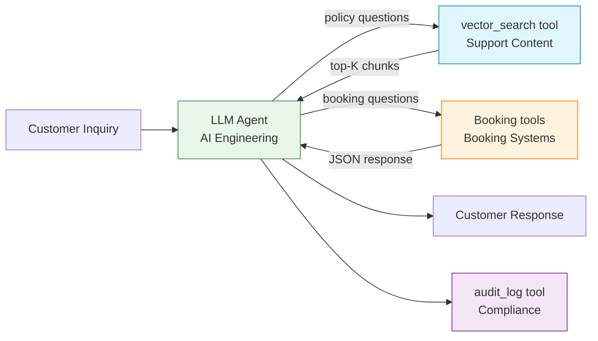
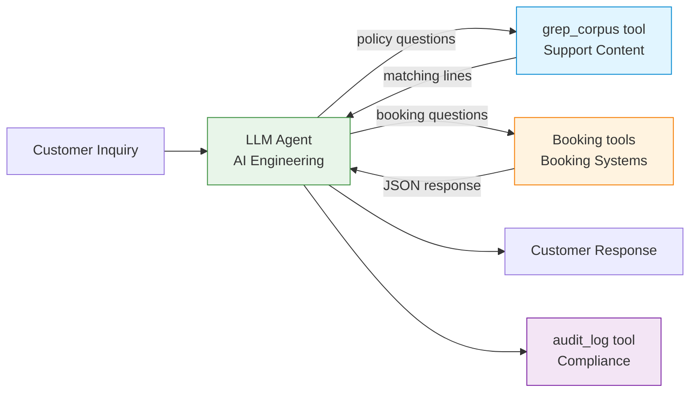
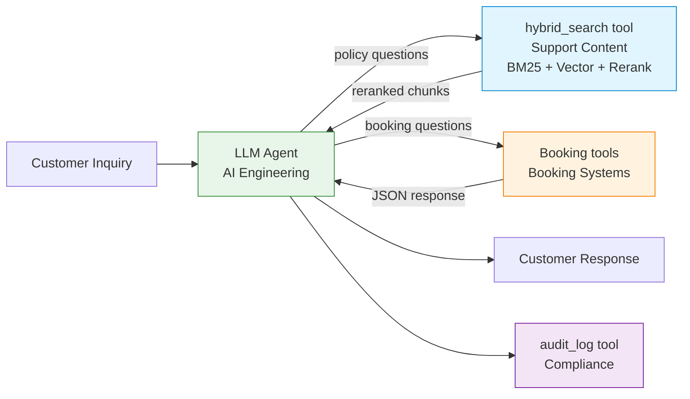

# Handover Document — Customer Support Agent

**Status:** v1 — Phase 2 ship (2026-06-04). Worked example of a deployment-readiness conversation, NOT the v1 experiment's approval gate. Recommendation section populated against measured numbers.
**From:** AI Engineering
**To:** Platform Operations, Support Content, Booking Systems, Compliance
**Purpose:** Document the architectures evaluated, the cross-team dependencies of each, and the recommended deployment path with honest trade-offs surfaced.

---

> **What this document is.** A worked example of the cross-team conversation that would surround a real deployment decision. v1 itself is a measurement artifact (see `README.md` §"What this project is not"); the measurement framework in `measurement/` is the load-bearing output. The §8 "Security and governance scope" section enumerates concerns a production deployment would need to address but v1 does not. The §10 sign-off table names stakeholder roles a real deployment conversation would include — **it is NOT an approval gate for the experiment itself**.

---

## 1. Project summary

The customer support agent handles a defined class of customer questions end-to-end — policy lookups, booking status queries, and combinations of the two. The agent produces a customer-facing response, cites the policy used (where applicable), and logs the interaction for audit.

Four architectures have been implemented and measured under a uniform set of constraints. This document presents all four, surfaces the cross-team dependencies of each, and recommends a deployment path based on the measurements.

The benchmark task set is in `measurement/tasks.jsonl`. Measurement results are in `measurement/results/comparison.md`. The rationale for choosing these architectures (and deferring others) is in `ARCHITECTURE_RATIONALE.md`.

---

## 2. The task being automated

Customer support inquiries falling into four classes:

| Class             | Example                                                    | Owner of source data       |
|-------------------|------------------------------------------------------------|----------------------------|
| Pure policy       | "What's your policy on changing a one-way ticket?"         | Support Content / Legal Ops |
| Pure transactional| "What's the status of my booking ABC123?"                  | Booking Systems            |
| Mixed             | "I want to change my flight XYZ — what are my options?"    | Both                       |
| Edge case         | "Can I get a refund on my voucher-paid ticket?"            | Both (with conditional logic) |

The agent must answer correctly, cite policy where invoked, and never invent policy text not present in the source.

---

## 3. The modularity constraint

All architectures evaluated here respect a uniform constraint that simulates enterprise org-chart reality:

| System            | Owner Team        | Access pattern                                  |
|-------------------|-------------------|-------------------------------------------------|
| FAQ corpus        | Support Content   | AI Engineering accesses via tools exposed by Support Content |
| Booking database  | Booking Systems   | AI Engineering accesses via tools exposed by Booking Systems |
| Audit log         | Compliance        | AI Engineering writes via tools exposed by Compliance |

This constraint is non-negotiable. No architecture is allowed to "win" on tokens by collapsing boundaries the org chart has set. Every cross-team data flow is an explicit tool call, owned by the team that owns the data.

The constraint matters because architecture decisions are constrained by who owns what. An architecture that requires AI Engineering to take ownership of policy text (for example) doesn't fail on engineering merit — it fails on organizational feasibility unless Support Content explicitly transfers ownership.

---

## 4. Architectures evaluated

### Naive RAG

The pattern most tutorials show and most v1 deployments ship.

**Inter-team interface:** Support Content publishes a vector store; AI Engineering's agent calls `vector_search(query, k=4)`.

**Operational requirements for Support Content:** Vector store re-indexing when FAQ corpus changes. Embedding model lifecycle management.

### Cached RAG

Identical architecture to A. Anthropic prompt caching enabled on the system prompt and the tool-definitions block (the two largest stable categories — ① + ④ ≈ 6,400 tokens). Retrieved chunks (category ②) are *not* cached because they change per query. The caching is internal to AI Engineering's consumption — Support Content's tool is unchanged.

**What changes:** AI Engineering's per-request cost drops **21% on total bill** (mean $0.0432/run vs Naive RAG $0.0548 at list price), driven by a **32% reduction on the input side** where 44% of input tokens are billed at the $0.30/MTok cache-read rate vs the $3/MTok standard rate. Output cost is unchanged and dominates the post-caching bill (38% of cached cost vs 28% of uncached). The architecture's inter-team boundaries don't change.

**What this surfaces:** Caching is an optimization within an architecture, not a separate architecture. Most teams running Naive RAG in production today have caching enabled. Comparing Naive RAG without caching to anything else overstates Naive RAG's real cost. The Phase 3 measurement also surfaces that **caching shifts cost shape, not magnitude** — the pre-registered 50–80% input-cost-reduction hypothesis over-anchored on the cache-read pricing without modeling the un-cached output share. For teams considering caching: budget for a ~20% per-request savings, not a cost collapse, and weight output-token-reduction work (shorter responses, better stop conditions) accordingly.

### Grep search

**Inter-team interface:** Support Content publishes a grep endpoint; AI Engineering's agent calls `grep_corpus(keywords, max_results=10)`.

**Operational requirements for Support Content:** Lower than Naive RAG. No vector store to maintain. No embedding model lifecycle. The corpus is served as text; the search is keyword-based.

**Trade-off:** The agent has to pick the right keywords. The bet of this architecture is that LLMs are good enough at keyword extraction that semantic retrieval isn't necessary for many tasks.

### Hybrid RAG

The pattern mature production teams converge on.

**Inter-team interface:** Support Content publishes a hybrid retrieval endpoint; AI Engineering's agent calls `hybrid_search(query, k=6)`.

**Operational requirements for Support Content:** Highest of the four. Maintains vector store, BM25 index, reranking model, and the orchestration that combines them. Tuning is ongoing — vector/BM25 weights, reranking model selection, threshold management.

---

## 5. Architectures considered but deferred

See `ARCHITECTURE_RATIONALE.md` for full discussion of why these are deferred to v2 rather than dropped.

- **Bounded tools.** One tool per policy class. Deferred because conceptually close to Hybrid RAG with curated chunks.
- **Stuffed corpus.** No retrieval. Deferred because SolDevelo's published finding makes the qualitative point.
- **Fine-tuned.** Different cost structure. Mentioned in article only.
- **Deterministic routing — Deterministic routing.** Different engineering effort. Mentioned in article only.
- **No-LLM.** Rhetorical baseline. Mentioned in article only.

---

## 6. Measurement results

v1: Phase 2 sweep at commit `5a1a6e8` (2026-06-04, three uncached architectures), judge snapshot `1dda831`, task set `tasks-frozen-v1`. Phase 3 Cached RAG sweep at commit `f32ffe3` (2026-06-04, append-only, no re-judge per Option Y). Full report in `measurement/results/comparison.md`; calibration findings in `measurement/results/runs/2026-06-04-phase2-step8b/judgment_summary.md`; Phase 3 sweep artifacts in `measurement/results/runs/2026-06-04-phase3-step12-cached-only/`.

### Summary across all task classes

| Architecture | Median input tokens / task | Mean input tokens / task | Mean cost / run (list) | Success rate (median of 3) | CoV across runs | Confidence |
|--------------|---------------------------:|-------------------------:|-----------------------:|---------------------------:|----------------:|------------|
| **Naive RAG**    | **12,354** | 13,064 | $0.0548 | **7/17 (41%)** | 6.3% | Cost: HIGH; Quality: MEDIUM |
| **Cached RAG**   | 12,503 | 13,863 | **$0.0432 (−21%)** | = Naive RAG | 7.6% | Cost: HIGH; Quality: MEDIUM (by construction) |
| Grep search  | 17,213 | 20,349 | $0.0779 | 7/17 (41%) | 14.9% | Cost: HIGH; Quality: MEDIUM |
| Hybrid RAG   | 13,312 | 16,291 | $0.0657 | 6/17 (35%) | 11.7% | Cost: HIGH; Quality: LOW (Finding C3, see comparison.md) |

Cost is contract-rate-dependent. Token ordering is mechanical (Anthropic API `usage.input_tokens` / `cache_read_input_tokens` / `cache_creation_input_tokens` fields) and contract-rate-independent.

### Per-class breakdown

Token costs (median input tokens per dispatch, including failed) and pass rates (out of 3 runs per task). For Cached RAG, "input tokens" refers to `processed_input_tokens` (the total tokens the model processed before caching discount; see `METHODOLOGY.md` §"What gets counted" for the field definition). Collapses to `api_input_tokens` for the uncached architectures.

| Class | Naive RAG tok / pass | Cached RAG tok / pass | Grep search tok / pass | Hybrid RAG tok / pass |
|---|---:|---:|---:|---:|
| Policy (n=3) | 10,277 / 1-of-3 | 10,262 / = Naive | 17,227 / 1-of-3 | 11,292 / 0-of-3 |
| Transactional (n=3) | 8,651 / 2-of-3 | 8,657 / = Naive | 8,990 / 2-of-3 | 8,735 / 1-of-3 |
| Mixed (n=8) | 12,500 / 3-of-8 | 12,990 / = Naive | 17,234 / 3-of-8 | 14,100 / 4-of-8 |
| Edge (n=3) | 13,248 / 1-of-3 | 16,719 / = Naive | 30,109 / 1-of-3 | 19,676 / 1-of-3 |

(Cached RAG's EDGE class median jumps to 16,719 because EDGE-003 ran 4 turns in 2/3 runs vs Naive's 3 — temp=0-not-byte-identical loop-length variance, not a caching cost penalty. See `comparison.md` §Edge case note.)

**Where the architecture comparison actually lives:**
- **Mixed tasks (47% of the task set)** are where production traffic concentrates. Hybrid RAG leads on pass rate (4/8 vs 3/8) at a modest +13% median cost premium over naive — the strongest case for hybrid's reranking. At current judge confidence (LOW for Hybrid RAG per Finding C3), the lift is suggestive, not definitive.
- **Transactional control** is the cost-floor — all three architectures within 5% of each other when retrieval workload is minimal.
- **Edge cases** inflate cost dramatically for grep (+127% over naive) and hybrid (+48%). Driven mostly by EDGE-001 (the safety-floor probe). Universal failure on EDGE-001 is methodology-gate-by-design, not architecture-discriminating.
- **Pure policy** is where grep shows its widest cost premium (+68% over naive). On the class where vector RAG is theoretically strongest, the cost gap is largest.

---

## 7. Risks and open questions

1. **Cache invalidation in Cached RAG.** Prompt caching depends on stable prefixes. Any change to the system prompt or to retrieved chunk ordering breaks the cache. Document the conditions under which Cached RAG's cost advantage holds vs. evaporates.
2. **Grep result quality in Grep search.** Grep's success depends on the LLM picking the right keywords. Document the failure modes — when does grep return nothing relevant, and how does the agent recover?
3. **Audit trail equivalence.** Each architecture's audit trail looks different. Compliance review needed to confirm all four meet requirements.
4. **Policy taxonomy completeness.** All measured architectures handle the existing FAQ corpus. New policy categories require:
   - Naive RAG and Hybrid RAG: re-indexing (owned by Support Content)
   - Cached RAG: same as Naive RAG, plus cache invalidation
   - Grep search: no action needed (grep always sees current corpus)
5. **Quality drift over time.** Not assessed in v1 (single measurement, no longitudinal study).

---

## 8. Security and governance scope

The following concerns would be required for a production deployment of any architecture measured here. They are explicitly out of scope for v1, which is a measurement artifact.

| Concern | In v1? | Required for production? | Notes |
|---|---|---|---|
| Data classification (corpus tiers) | No | Yes | Corpus content treated as uniform; real corpora need public/internal/restricted tiers with access enforcement |
| PII handling at tool boundary | No | Yes | Swiss FAQ contains no PII; production tools would need PII redaction before content reaches the model |
| Data residency | No (US, via Anthropic) | Yes (jurisdiction-dependent) | Inference calls go to Anthropic data centers; EU/regulated deployers must verify adequacy or use an alternative inference path |
| Compliance-grade audit payload | No (measurement-grade only) | Yes | v1 logs `task_id`, `response`, `tools_called` for measurement equality; production needs timestamps, identity, model version, retrieval evidence |
| Prompt injection defenses | No | Yes | No injection detection, no untrusted-input boundary on user queries |
| Indirect prompt injection (corpus poisoning) | No | Yes | Corpus is assumed trusted; no provenance verification on chunks before retrieval |
| At-rest encryption | No (plaintext) | Yes | Vector store, BM25 index, SQLite DB all unencrypted on local disk |
| Retention policy (audit logs, indices, raw runs) | No | Yes | No retention SLA defined |
| Supply chain — model integrity | Partial | Yes | `requirements.txt` pins versions; BGE-M3 download integrity relies on HuggingFace TLS — accepted risk for v1, hash verification required for production |
| Threat model | No | Yes | No formal threat model; METHODOLOGY's adversarial review covers measurement bias, not security |

This enumeration is the credibility move. The experiment does not claim to address these; listing them lets a real deployment conversation begin from a complete inventory rather than discovering gaps after the fact.

---

## 9. Recommended path forward

Recommendation grounded in v1 measured numbers and the §10 adversarial review findings.

### 9.1 Architecture to deploy first

**Start with Cached RAG (Naive RAG + prompt caching on system prompt + tool definitions).** It is the cheapest measured architecture at mean $0.0432/run — 21% under uncached Naive RAG and 34–45% under Hybrid RAG and Grep search at list price. Among uncached architectures, Naive RAG remains the recommendation if prompt caching is unavailable (median 12,354 input tokens; +8% to +25% under Hybrid RAG depending on aggregation; +39% to +56% under Grep search). On pass rate Cached RAG inherits Naive RAG's profile (= Naive RAG by construction; ties Grep search at 7/17, modestly above Hybrid RAG at current measurement confidence). The cost advantage is robust — it does not depend on judge calibration choices, it does not depend on which tasks pass or fail, and it does not depend on known Hybrid RAG implementation bugs (the bugs are quality bugs; cost is bounded by the k=4 vs k=6 architectural choice).

**Realistic expectations on caching:** Caching shifts cost *shape*, not magnitude — output tokens go from 28% to 38% of the bill once input is cached. Budget for a ~20% per-request savings, not the 50–80% input-cost-reduction headline that surface readings of Anthropic's pricing might suggest. Output-token-reduction work (shorter responses, better stop conditions) is the natural next optimization once caching is enabled.

This recommendation is conditional on the workload class measured: enterprise customer support on a structured policy corpus (~30 chunks), single-turn dialogue, Sonnet-4.6-tier reasoning. The conditional applies because v1 explicitly does not measure (a) larger corpora where Hybrid RAG's quality edge may compound, (b) multi-turn dialogue where caching effects start to dominate, (c) other model tiers where cheaper-model interactions with retrieved-context length could re-rank the architectures.

The recommendation does *not* preclude Hybrid RAG. Hybrid RAG's measured cost premium is real and architectural (k=6 vs k=4 chunks for the reranker). Whether the premium buys quality is currently LOW-confidence because of Finding C3 (`comparison.md` §"Confidence and known biases" and `judgment_summary.md` §"Manual review findings"). A v2 measurement cycle with a blinded judge prompt and Hybrid RAG bug fixes is queued in `ROADMAP.md` §"Quality re-measurement series" and will settle the quality story before any quality-vs-cost recommendation upgrade for Hybrid RAG.

The recommendation explicitly *does* preclude Grep search as the primary deployment for this workload class on cost grounds. Grep is +39% median / +56% mean over Naive at the same pass rate. The grep-specific quality properties that the current rubric does not measure (safety-floor behavior on suspect content, audit-trail inspectability) may justify grep in narrower contexts (compliance-heavy workloads, environments where no vector store is operationally tenable), but those would need a different measurement framing.

### 9.2 Conditions that would change the recommendation

- **Larger corpus (thousands of chunks):** BGE-M3 vector retrieval quality degrades with corpus size; BM25 exact-match advantage grows. The cost/quality tradeoff likely shifts toward Hybrid RAG. v1 cannot extrapolate; a follow-on benchmark on a 10× larger corpus would be the test.
- **Multi-turn dialogue:** category ⑤ (agent intermediate) compounds across turns. Naive RAG's per-turn agent_intermediate is the smallest of the three (mean 638 vs hybrid 685 vs grep 816). The naive advantage likely *strengthens* under multi-turn. This recommendation extends.
- **Workload dominated by exact-string lookups** (specific section names, identifiers): BM25 and grep gain a quality edge that pure vector retrieval doesn't. Recommendation would shift toward Hybrid RAG (BM25 + reranker) or grep.
- **Sonnet 4.6 is too expensive for the volume:** moving to Haiku 4.5 may interact differently with retrieved context length. v1 does not extrapolate to other models.
- **Operational reality where Support Content cannot maintain a vector store:** Naive RAG and Hybrid RAG both require Support Content to run an indexing pipeline. If that's organizationally infeasible, Grep search becomes attractive despite its cost premium.

### 9.3 What we are explicitly not optimizing for in v1

- **Multi-turn dialogue.** Single-turn only.
- **Voice / streaming channels.** Text only.
- **Multi-language.** English only.
- **Caching effects on Grep search and Hybrid RAG.** v1 measures the caching effect on Naive RAG (Cached RAG, Phase 3). The companion question — does the 21% savings extend to Grep and Hybrid — is queued for v2 (the remaining two cells of the cache matrix).
- **Adaptation cost** when the corpus changes. Beyond v2 (`ROADMAP.md`).
- **Production-grade security and governance.** §8 enumerates these as out of scope for the measurement experiment; a production deployment would need to address each.

### 9.4 Confidence

- **Cost ordering Cached < Naive < Hybrid < Grep: HIGH confidence.** Mechanical token measurements; robust to filtering, to known bug status, and to caching configuration. Caching's 21% savings on Naive RAG is measured directly via `cache_read_input_tokens` / `cache_creation_input_tokens` from the Anthropic API.
- **Quality differences between architectures: LOW confidence.** Contaminated by Finding C3 (judge architecture-label leak). Treat current pass rates as preliminary; the v2 re-measurement is the next step. Full confidence rubric in `comparison.md` §"Net confidence statement."

### 9.5 What this recommendation is

An input to the cross-team conversation that Support Operations, Compliance, Booking Systems, and AI Engineering leadership need to have together. Not a final decision. The §10 sign-off table below names the stakeholders that conversation would include.

---

## 10. Sign-offs required

| Role                          | Reviewer | Status |
|-------------------------------|----------|--------|
| AI Engineering Lead           | _TBD_    | _TBD_  |
| Support Content Lead          | _TBD_    | _TBD_  |
| Booking Systems Lead          | _TBD_    | _TBD_  |
| Compliance / SecOps           | _TBD_    | _TBD_  |
| Legal Ops (policy text)       | _TBD_    | _TBD_  |

---

## Appendix — Reference materials

- Measurement methodology: `METHODOLOGY.md`
- Architecture rationale (why these, why not others): `ARCHITECTURE_RATIONALE.md`
- Roadmap (v1 scope, v2 deferred, beyond): `ROADMAP.md`
- Per-architecture implementation notes: `architectures/<arch>/README.md`
- Companion article: [link when published]
