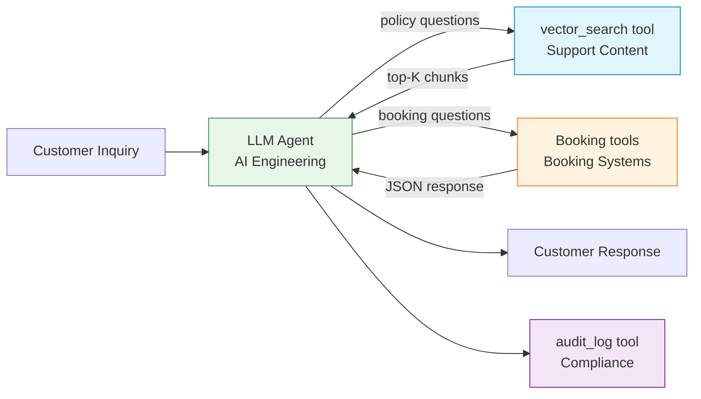
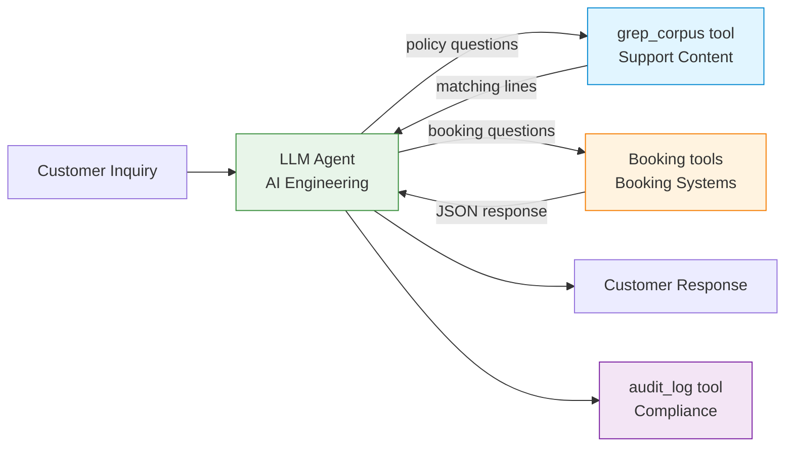
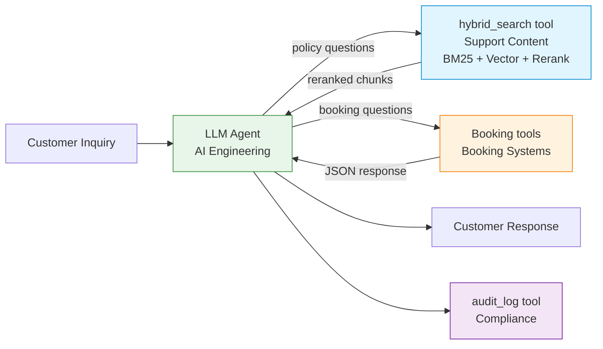

# Handover Document — Customer Support Agent

**Status:** Draft for review
**From:** AI Engineering
**To:** Platform Operations, Support Content, Booking Systems, Compliance
**Purpose:** Document the architectures evaluated, the cross-team dependencies of each, and the recommended deployment path with honest trade-offs surfaced.

---

## 1. Project summary

The customer support agent handles a defined class of customer questions end-to-end — policy lookups, booking status queries, and combinations of the two. The agent produces a customer-facing response, cites the policy used (where applicable), and logs the interaction for audit.

Four architectures have been implemented and measured under a uniform set of constraints. This document presents all four, surfaces the cross-team dependencies of each, and recommends a deployment path based on the measurements.

The benchmark task set is in `measurement/tasks.jsonl`. Measurement results are in `measurement/results/comparison.md`. The rationale for choosing these architectures (and deferring others) is in `ARCHITECTURE_RATIONALE.md`.

---

## 2. The task being automated

Customer support inquiries falling into four classes:

| Class             | Example                                                    | Owner of source data       |
|-------------------|------------------------------------------------------------|----------------------------|
| Pure policy       | "What's your policy on changing a one-way ticket?"         | Support Content / Legal Ops |
| Pure transactional| "What's the status of my booking ABC123?"                  | Booking Systems            |
| Mixed             | "I want to change my flight XYZ — what are my options?"    | Both                       |
| Edge case         | "Can I get a refund on my voucher-paid ticket?"            | Both (with conditional logic) |

The agent must answer correctly, cite policy where invoked, and never invent policy text not present in the source.

---

## 3. The modularity constraint

All architectures evaluated here respect a uniform constraint that simulates enterprise org-chart reality:

| System            | Owner Team        | Access pattern                                  |
|-------------------|-------------------|-------------------------------------------------|
| FAQ corpus        | Support Content   | AI Engineering accesses via tools exposed by Support Content |
| Booking database  | Booking Systems   | AI Engineering accesses via tools exposed by Booking Systems |
| Audit log         | Compliance        | AI Engineering writes via tools exposed by Compliance |

This constraint is non-negotiable. No architecture is allowed to "win" on tokens by collapsing boundaries the org chart has set. Every cross-team data flow is an explicit tool call, owned by the team that owns the data.

The constraint matters because architecture decisions are constrained by who owns what. An architecture that requires AI Engineering to take ownership of policy text (for example) doesn't fail on engineering merit — it fails on organizational feasibility unless Support Content explicitly transfers ownership.

---

## 4. Architectures evaluated

### Architecture A — Naive RAG

The pattern most tutorials show and most v1 deployments ship.

**Inter-team interface:** Support Content publishes a vector store; AI Engineering's agent calls `vector_search(query, k=4)`.

**Operational requirements for Support Content:** Vector store re-indexing when FAQ corpus changes. Embedding model lifecycle management.

### Architecture A+G — Naive RAG with prompt caching

Identical architecture to A. Anthropic prompt caching enabled on the system prompt and stable retrieved chunks. The caching is internal to AI Engineering's consumption — Support Content's tool is unchanged.

**What changes:** AI Engineering's per-request cost drops dramatically (up to 90% on cached prefixes). The architecture's inter-team boundaries don't change.

**What this surfaces:** Caching is an optimization within an architecture, not a separate architecture. Most teams running A in production today have caching enabled. Comparing A without caching to anything else overstates A's real cost.

### Architecture C — Grep

**Inter-team interface:** Support Content publishes a grep endpoint; AI Engineering's agent calls `grep_corpus(keywords, max_results=10)`.

**Operational requirements for Support Content:** Lower than A. No vector store to maintain. No embedding model lifecycle. The corpus is served as text; the search is keyword-based.

**Trade-off:** The agent has to pick the right keywords. The bet of this architecture is that LLMs are good enough at keyword extraction that semantic retrieval isn't necessary for many tasks.

### Architecture E — Hybrid RAG

The pattern mature production teams converge on.

**Inter-team interface:** Support Content publishes a hybrid retrieval endpoint; AI Engineering's agent calls `hybrid_search(query, k=6)`.

**Operational requirements for Support Content:** Highest of the four. Maintains vector store, BM25 index, reranking model, and the orchestration that combines them. Tuning is ongoing — vector/BM25 weights, reranking model selection, threshold management.

---

## 5. Architectures considered but deferred

See `ARCHITECTURE_RATIONALE.md` for full discussion of why these are deferred to v2 rather than dropped.

- **Architecture B — Bounded structured tools.** One tool per policy class. Deferred because conceptually close to E with curated chunks.
- **Architecture D — Full corpus stuffed.** No retrieval. Deferred because SolDevelo's published finding makes the qualitative point.
- **Architecture F — Fine-tuned model.** Different cost structure. Mentioned in article only.
- **Architecture H — Deterministic routing.** Different engineering effort. Mentioned in article only.
- **Architecture I — No LLM at all.** Rhetorical baseline. Mentioned in article only.

---

## 6. Measurement results

> _To be populated after measurement runs. Structure below indicates what will be reported._

### Summary across all task classes

| Architecture       | Mean total tokens / task | Mean cost / task | Cost / 10K tasks | Success rate | Mean latency |
|--------------------|--------------------------|------------------|------------------|--------------|--------------|
| A — Naive RAG      | _TBD_                    | $_TBD_           | $_TBD_           | _TBD_%       | _TBD_s       |
| A+G — A w/ cache   | _TBD_                    | $_TBD_           | $_TBD_           | _TBD_%       | _TBD_s       |
| C — Grep           | _TBD_                    | $_TBD_           | $_TBD_           | _TBD_%       | _TBD_s       |
| E — Hybrid RAG     | _TBD_                    | $_TBD_           | $_TBD_           | _TBD_%       | _TBD_s       |

### Per-class breakdown

The interesting question is whether different architectures suit different task classes. If one architecture is uniformly best, the choice is straightforward. If A+G wins on cost but loses on edge cases, or C wins on simple queries but fails on mixed ones, the right answer depends on production traffic shape.

> _Per-class tables to be populated._

---

## 7. Risks and open questions

1. **Cache invalidation in A+G.** Prompt caching depends on stable prefixes. Any change to the system prompt or to retrieved chunk ordering breaks the cache. Document the conditions under which A+G's cost advantage holds vs. evaporates.
2. **Grep result quality in C.** Grep's success depends on the LLM picking the right keywords. Document the failure modes — when does grep return nothing relevant, and how does the agent recover?
3. **Audit trail equivalence.** Each architecture's audit trail looks different. Compliance review needed to confirm all four meet requirements.
4. **Policy taxonomy completeness.** All measured architectures handle the existing FAQ corpus. New policy categories require:
   - A and E: re-indexing (owned by Support Content)
   - A+G: same as A, plus cache invalidation
   - C: no action needed (grep always sees current corpus)
5. **Quality drift over time.** Not assessed in v1 (single measurement, no longitudinal study).

---

## 8. Recommended path forward

> _To be filled in after measurement results are known. The recommendation depends on the measured trade-offs._

The recommendation will state:

1. **Which architecture to deploy first**, with rationale grounded in measured numbers and the operational/organizational reality of current team boundaries.
2. **What conditions would change the recommendation** — e.g., if traffic patterns shift, if Support Content changes their operational model, if a different cost sensitivity dominates.
3. **What we are explicitly not optimizing for in v1** — multi-turn, voice channel, multi-language.
4. **Honest confidence level**, per the adversarial review in `comparison.md`.

The recommendation is not a final decision. It is an input to the cross-team conversation that Support Operations, Compliance, Booking Systems, and AI Engineering leadership need to have together.

---

## 9. Sign-offs required

| Role                          | Reviewer | Status |
|-------------------------------|----------|--------|
| AI Engineering Lead           | _TBD_    | _TBD_  |
| Support Content Lead          | _TBD_    | _TBD_  |
| Booking Systems Lead          | _TBD_    | _TBD_  |
| Compliance / SecOps           | _TBD_    | _TBD_  |
| Legal Ops (policy text)       | _TBD_    | _TBD_  |

---

## Appendix — Reference materials

- Measurement methodology: `METHODOLOGY.md`
- Architecture rationale (why these, why not others): `ARCHITECTURE_RATIONALE.md`
- Roadmap (v1 scope, v2 deferred, beyond): `ROADMAP.md`
- Per-architecture implementation notes: `architectures/<arch>/README.md`
- Companion article: [link when published]
