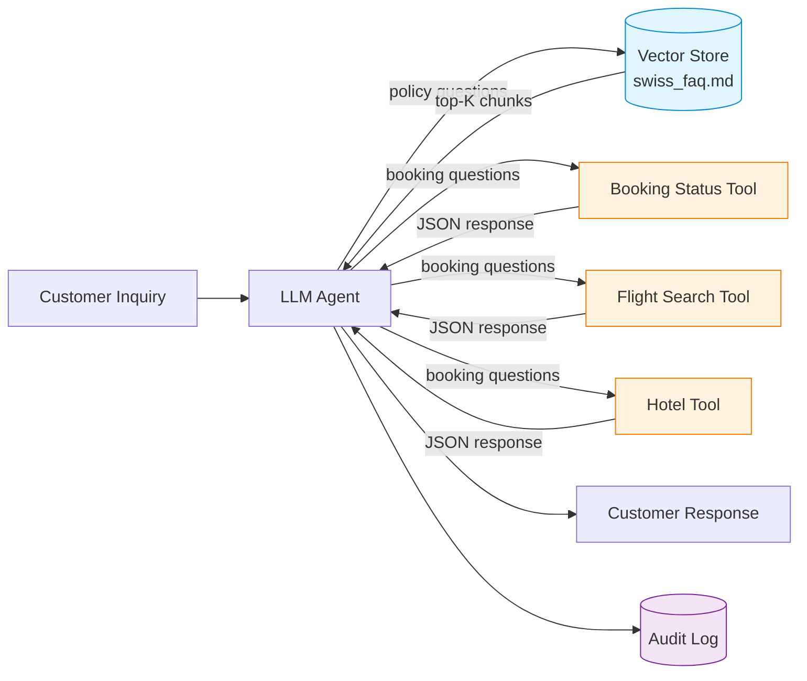
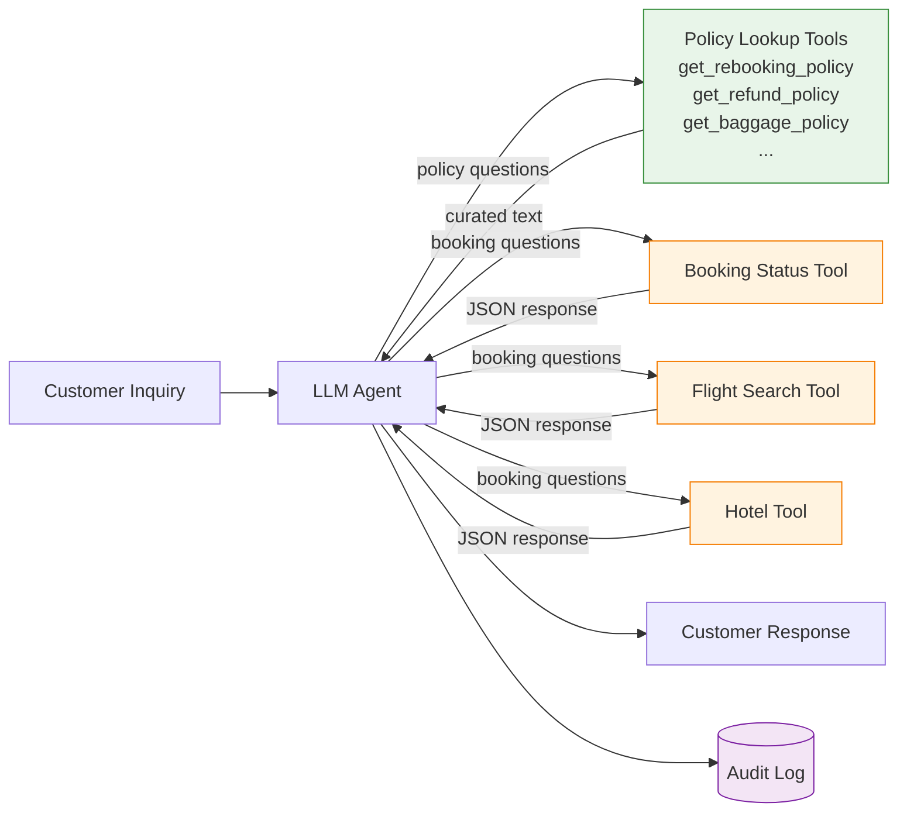

# Handover Document — Customer Support Agent

**Status:** Draft for review
**From:** AI Engineering
**To:** Platform Operations, Support Operations, Compliance
**Purpose:** Document the architecture, dependencies, and team coordination required to deploy the customer support agent to production.

---

## 1. Project summary

The customer support agent is designed to handle a defined class of customer questions end-to-end — policy lookups, booking status queries, and combinations of the two. The agent produces a customer-facing response, cites the policy used (where applicable), and logs the interaction for audit.

Two architectures have been implemented and measured. This document presents both, surfaces the cross-team dependencies of each, and recommends a deployment path.

The benchmark task set is in `measurement/tasks.jsonl`. The measurement results are in `measurement/results/comparison.md`.

---

## 2. The task being automated

Customer support inquiries falling into four classes:

| Class             | Example                                                    | Owner of source data       |
|-------------------|------------------------------------------------------------|----------------------------|
| Pure policy       | "What is your rebooking policy for one-way tickets?"       | Support Content / Legal Ops |
| Pure transactional| "What's the status of my booking ABC123?"                  | Booking Systems            |
| Mixed             | "I want to rebook flight XYZ — is that allowed?"           | Both                       |
| Edge case         | "Can I get a refund on my voucher-paid ticket?"            | Both (with conditional logic) |

The agent must answer correctly, cite policy where invoked, and never invent policy text not present in the source.

---

## 3. Architecture A — RAG + Tool Calls

The canonical pattern. Follows the LangGraph customer support tutorial.

### System diagram

### Team dependencies

| System              | Owner                  | What we need from them                                                          |
|---------------------|------------------------|---------------------------------------------------------------------------------|
| Vector store        | Support Content Team   | Ingestion pipeline, chunk strategy approval, policy update SLA, embedding model approval |
| FAQ corpus          | Support Content + Legal Ops | Approval of policy text as customer-facing, change notification process    |
| Booking tools       | Booking Systems Team   | Read API access, rate limit allowance, SLA for booking-status endpoint          |
| Audit logging       | Compliance / SecOps    | Log schema approval, retention policy alignment, PII handling sign-off          |
| Model inference     | AI Engineering         | (Internal)                                                                       |

### Operational requirements

- Vector store re-indexing when FAQ corpus changes (estimated 2× per quarter based on current policy update cadence)
- Embedding model lifecycle (when do we re-embed if we upgrade the model)
- Retrieval quality monitoring (drift detection, eval suite)
- Tool endpoint health monitoring with circuit breaker

---

## 4. Architecture B — Bounded Tools

No vector store. Policy content is served through targeted lookup tools owned by AI Engineering, each returning curated text for a specific policy class.

### System diagram

### Team dependencies

| System              | Owner                  | What we need from them                                                                            |
|---------------------|------------------------|---------------------------------------------------------------------------------------------------|
| Policy lookup tools | **AI Engineering (new)** | **Open question:** does AI Engineering own the policy text directly, or does Support Content publish to a structured policy registry that AI Engineering consumes? |
| FAQ corpus          | Support Content + Legal Ops | Approval of policy text as customer-facing, change notification process                       |
| Booking tools       | Booking Systems Team   | Read API access, rate limit allowance, SLA for booking-status endpoint                            |
| Audit logging       | Compliance / SecOps    | Log schema approval, retention policy alignment, PII handling sign-off                            |

### The unresolved boundary question

Architecture B is operationally simpler but introduces a governance question that Architecture A's vector-store approach answers by default:

**Who owns the canonical policy text and is responsible for keeping the agent's responses synchronized with the published policy?**

In Architecture A, the vector store is owned by Support Content. When policy changes, they re-ingest. The boundary is clean: AI Engineering consumes; Support Content publishes.

In Architecture B, the policy text lives inside tools owned by AI Engineering. If Support Content updates policy without notifying AI Engineering, the agent silently serves stale text. Possible resolutions:

- **Option 1:** Support Content publishes a structured policy registry (JSON/YAML) that AI Engineering's tools consume. New artifact, new ownership boundary.
- **Option 2:** Support Content owns the policy lookup tools directly. Requires Support Content to develop/maintain code, which is outside their current operating model.
- **Option 3:** AI Engineering owns the tools but subscribes to Support Content's change notifications. Process-based, brittle.

This question is not solvable inside AI Engineering. It requires alignment between Support Content, Legal Ops, and AI Engineering leadership.

---

## 5. Measurement results

> _To be populated after measurement runs. Structure below indicates what will be reported._

### Summary across all task classes

| Metric                          | Architecture A | Architecture B | Delta |
|---------------------------------|----------------|----------------|-------|
| Mean total tokens per task      | _TBD_          | _TBD_          | _TBD_ |
| Mean cost per task (Sonnet 4)   | _TBD_          | _TBD_          | _TBD_ |
| Cost per 10,000 tasks           | _TBD_          | _TBD_          | _TBD_ |
| Task success rate               | _TBD_          | _TBD_          | _TBD_ |

### Per-class breakdown

> _The interesting question is whether the architectures perform differently on different task classes._

| Task class          | Arch A tokens | Arch B tokens | Arch A success | Arch B success |
|---------------------|---------------|---------------|----------------|----------------|
| Pure policy         | _TBD_         | _TBD_         | _TBD_          | _TBD_          |
| Pure transactional  | _TBD_         | _TBD_         | _TBD_          | _TBD_          |
| Mixed               | _TBD_         | _TBD_         | _TBD_          | _TBD_          |
| Edge case           | _TBD_         | _TBD_         | _TBD_          | _TBD_          |

### Token decomposition (Silicon Data methodology)

| Component                       | Arch A (mean) | Arch B (mean) |
|---------------------------------|---------------|---------------|
| System prompt                   | _TBD_         | _TBD_         |
| Retrieved/injected context      | _TBD_         | _TBD_         |
| User message                    | _TBD_         | _TBD_         |
| Tool call overhead              | _TBD_         | _TBD_         |
| Response                        | _TBD_         | _TBD_         |

---

## 6. Risks and open questions

1. **Policy ownership in Architecture B** (see §4). Unresolved.
2. **Audit trail equivalence.** Architecture A's vector retrieval logs which chunks were used; Architecture B's tool calls log which policy tool was invoked. Different evidence trails; compliance review needed to confirm both meet requirements.
3. **Policy taxonomy completeness.** Architecture B assumes the policy taxonomy is closed (we know in advance which policy classes exist). If new policy categories emerge frequently, Architecture B requires code changes, while Architecture A absorbs them through re-indexing.
4. **Multi-language support.** Both architectures need a strategy. RAG can use multilingual embeddings; bounded tools need per-language policy variants. Not assessed in this measurement.
5. **Quality drift over time.** Neither architecture has been observed for long enough to assess maintenance burden. Architecture B has lower initial complexity but its quality depends entirely on policy text curation discipline.

---

## 7. Recommended path forward

> _To be filled in after measurement results are known. The recommendation depends on the measured trade-offs._

The recommendation will state:

1. **Which architecture to deploy first**, with rationale grounded in the measured numbers and the operational/organizational reality of the current team boundaries.
2. **What conditions would change the recommendation** — e.g., if Support Content adopts a structured policy registry, the calculus shifts toward Architecture B.
3. **What we are explicitly not optimizing for in v1** — for example, multi-language support, voice channel, multi-turn dialog memory beyond a single session.

The recommendation is not a final decision. It is an input to the cross-team conversation that Support Operations, Compliance, and AI Engineering leadership need to have together.

---

## 8. Sign-offs required

| Role                          | Reviewer | Status |
|-------------------------------|----------|--------|
| AI Engineering Lead           | _TBD_    | _TBD_  |
| Support Content Lead          | _TBD_    | _TBD_  |
| Booking Systems Lead          | _TBD_    | _TBD_  |
| Compliance / SecOps           | _TBD_    | _TBD_  |
| Legal Ops (policy text)       | _TBD_    | _TBD_  |

---

## Appendix — Reference materials

- Measurement methodology: `METHODOLOGY.md`
- Architecture A implementation notes: `architecture_a_rag/README.md`
- Architecture B implementation notes: `architecture_b_bounded/README.md`
- Companion article: [link to published article when ready]
