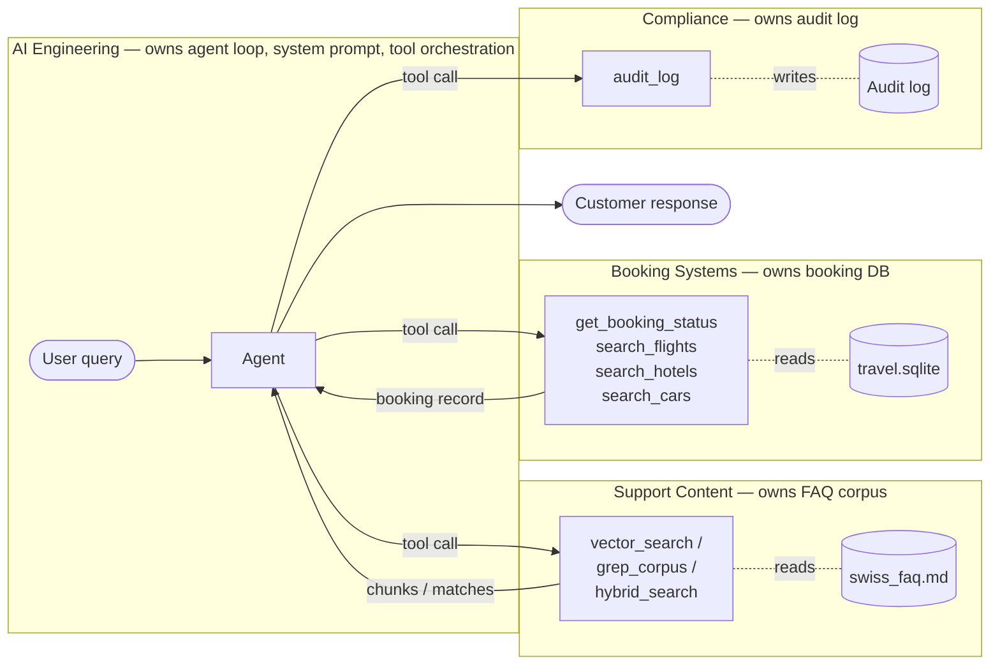

# Measurement Methodology

This document specifies how token measurements are taken, what is counted, what is excluded, and what the measurements can and cannot support as claims.

## Why this document exists

Measurement-based comparisons of LLM architectures are easy to manipulate, intentionally or not. Different teams measuring "tokens per request" can produce 5× different numbers depending on what they count. This document fixes the methodology in advance so the comparison is defensible.

If you disagree with any choice below, the right move is to fork the methodology and re-measure. The results in this repo are valid only under the methodology specified here.

## Model and configuration

- **Agent model:** `claude-sonnet-4-6` (Sonnet 4.6 dateless ID; current mid-tier production default in 2026)
- **Judge model:** `claude-opus-4-7` (Opus 4.7 dateless ID; current strongest model, used for LLM-as-judge scoring)
- **Embedding model:** `BAAI/bge-m3` (MIT-licensed, self-hosted, the 2026 enterprise default for self-hosted RAG). Used by Naive RAG, Cached RAG, and Hybrid RAG. This is a deliberate alignment with enterprise self-hosted practice rather than API-based embedding services. The choice eliminates data egress concerns that would arise from sending corpus content to third-party embedding APIs — a hard constraint in regulated industries and a soft constraint in most enterprise contexts. Retrieval quality is comparable to commercial APIs (text-embedding-3-large) on most public benchmarks.
- **Temperature:** 0.0 (for reproducibility; production deployments would typically use 0.3–0.7)
- **Max tokens:** 1024 (response cap)
- **Tools:** Native Anthropic function calling
- **Cache:** Disabled for Naive RAG, Grep search, and Hybrid RAG. Enabled for Cached RAG (which exists specifically to measure the caching effect). Documented per-architecture.

### Model ID stability

Per Anthropic's model versioning policy, dateless IDs (e.g., `claude-sonnet-4-6`) are pinned snapshots, not evergreen pointers. The model behind a given ID does not change. When Anthropic ships an updated version, it gets a new ID.

This means: the numbers in this benchmark are reproducible against the specific model version at time of measurement. Future model releases will not invalidate these numbers — they will just produce different numbers when re-measured against the newer model.

### API vs self-hosted choices

The agent inference model is an API (Anthropic); the embedding model is self-hosted (BGE-M3). This asymmetry is deliberate.

- **Embedding** sees the full corpus during indexing and the user message at query time. Sending corpus content to a third-party API creates data egress exposure that conflicts with the enterprise framing this experiment targets. Self-hosted is the correct default for embedding.
- **Inference** sees only the assembled prompt (system prompt + retrieved context + user message) at the moment of the call. The data exposure profile is narrower, and the cost-vs-quality tradeoff at this scale favors API-based inference.

Hybrid RAG's reranker (`cross-encoder/ms-marco-MiniLM-L-6-v2`) is also self-hosted, consistent with the embedding choice — the inter-team interface Support Content publishes runs entirely within a perimeter Support Content controls.

If a reader of the published article asks "why API for inference but self-hosted for embedding," the answer is: different data exposure profile, different cost-vs-quality tradeoff, different operational complexity. The framework supports both choices honestly.

## Modularity constraint

This is a hard constraint on all architectures, designed to simulate enterprise org-chart reality.

### The constraint

The simulated organization has the following team boundaries:

| System            | Owner Team        | Access pattern                                  |
|-------------------|-------------------|-------------------------------------------------|
| FAQ corpus        | Support Content   | AI Engineering accesses via tools exposed by Support Content |
| Booking database  | Booking Systems   | AI Engineering accesses via tools exposed by Booking Systems |
| Audit log         | Compliance        | AI Engineering writes via tools exposed by Compliance |

### Rules every architecture must follow

1. **No direct file system access.** AI Engineering's agent code does not read `corpus/swiss_faq.md` directly. It calls a tool. The tool implementation may live in the same repo (for v1 simplicity), but the *architectural boundary* is enforced — the agent only sees the tool's response.

2. **No direct database access.** Same rule for `data/travel.sqlite`. The agent calls tools; the tools query the database.

3. **No direct corpus mutation.** AI Engineering cannot pre-process or restructure the corpus to its preferred shape. If a transformation is needed (chunking for Naive RAG, partitioning for Bounded tools in v2), that transformation is owned by Support Content and exposed through whatever interface they publish.

4. **Cross-team interfaces are explicit.** Every tool's input/output schema is part of the inter-team contract. Schema changes are inter-team negotiations, not silent updates.

### Data flow under the constraint

AI Engineering owns the agent loop. Every piece of data the agent reads or writes crosses a team boundary as an explicit tool call — never as a direct file or DB read.



The dotted lines are inside each team's boundary; the solid arrows crossing boundaries are the only sanctioned cross-team data flow. Architecture choice changes which tool Support Content exposes (`vector_search` vs `grep_corpus` vs `hybrid_search`), not the boundary itself.

### What this constraint changes

Without the constraint, the experiment would measure "what's the cheapest way to do this if one team owns everything" — which is the solo-founder context, not the enterprise context the article targets.

With the constraint, the experiment measures "what's the cheapest way to do this when the org chart is load-bearing infrastructure." Absolute token numbers may be higher across the board (due to inter-team API overhead), but the relative comparison reflects realistic enterprise conditions.

### How each architecture implements the constraint

Brief summary; full implementation specs in each architecture's README.

| Architecture | Inter-team interface                                                        |
|--------------|------------------------------------------------------------------------------|
| Naive RAG    | Support Content exposes `vector_search(query, k)`; AI Engineering consumes  |
| Cached RAG   | Same as Naive RAG; caching is internal to the consumer side                 |
| Grep search  | Support Content exposes `grep_corpus(keywords)`; AI Engineering consumes    |
| Hybrid RAG   | Support Content exposes `hybrid_search(query, k)`; AI Engineering consumes  |

Booking-related tools (`get_booking_status`, etc.) are identical across all architectures — they're exposed by Booking Systems regardless of which retrieval architecture is used.

### Audit log specification

Every architecture writes to Compliance's `audit_log` tool. To prevent architectural differences from leaking into Compliance overhead in a way that would bias the comparison, the audit payload is uniform across all architectures.

Required fields per audit_log call:

| Field          | Type    | Description                                          |
|----------------|---------|------------------------------------------------------|
| `task_id`      | string  | Identifier of the task being processed               |
| `response`     | string  | The agent's final response to the customer           |
| `tools_called` | list    | Names of tools invoked during this task (in order)   |

Forbidden in the audit payload (would introduce architectural variance):
- Retrieved chunk content (architecture-specific)
- Search keywords or query embeddings (architecture-specific)
- Internal reasoning traces (architecture-specific)

This is a deliberate methodology choice. Different architectures *could* log different things in production (Compliance might want chunk-level audit trails for RAG and keyword traces for grep). For the measurement, uniform payload removes the variable.

audit_log calls and their token cost are **excluded** from the per-task token decomposition, same as embedding compute. Their cost is approximately constant across architectures, so including or excluding them does not change relative comparisons.

### Conceptual vs. structural boundaries

The modularity constraint is conceptual, not structural. In v1's single-Python-process repo, the boundaries are enforced by interface discipline: the agent only sees tool responses, never internal data structures of the team that owns the data.

This is appropriate for a measurement experiment. A production deployment of any of these architectures would require real separation across deployable units (separate services, separate repos, separate teams), with the tool's input/output schema as the inter-team contract. The schemas defined in v1 are designed to be portable to that real separation; the directory structure in v1 is not.

## What gets counted

For each task run, the following are recorded from the API response:

| Field                          | Source                                      |
|--------------------------------|---------------------------------------------|
| `input_tokens`                 | API usage object (provider-reported)        |
| `output_tokens`                | API usage object (provider-reported)        |
| `cache_creation_input_tokens`  | API usage object (zero for Naive RAG / Grep search / Hybrid RAG, non-zero for Cached RAG) |
| `cache_read_input_tokens`      | API usage object (zero for Naive RAG / Grep search / Hybrid RAG, non-zero for Cached RAG) |

These raw numbers are then decomposed into six categories — the original five from the [Silicon Data methodology](https://www.silicondata.com/blog/llm-cost-per-token) plus `agent_intermediate`, which we added in Phase 2 once multi-turn tool loops landed (see "Multi-turn extension" below):

1. **System prompt tokens** — counted via Anthropic's `client.beta.messages.count_tokens()` API on the system prompt string
2. **Retrieved/injected context tokens** — counted via `count_tokens` on the concatenated tool response text
3. **User message tokens** — counted via `count_tokens` on the user message
4. **Tool call overhead tokens** — counted via `count_tokens` on the tool schema JSON sent in the request
5. **Agent intermediate tokens** — counted via `count_tokens` on assistant-role content (text + `tool_use` blocks) from PRIOR turns that gets echoed back as input on subsequent turns
6. **Response tokens** — provider-reported `output_tokens`

### Tokenizer note

This project does NOT use `tiktoken`. `tiktoken` is OpenAI's tokenizer and will produce wrong counts for Anthropic models. Use Anthropic's official `count_tokens` API for all input decomposition.

The sum of categories 1–5 should approximately equal `input_tokens` reported by the API, within small variance for how messages are framed for the API call. The runner asserts this equality within 5% tolerance and flags discrepancies.

### Multi-turn extension (`agent_intermediate`)

The Silicon Data methodology was specified for single-turn API calls. The four input categories (system, retrieved, user, tools) cover every token the customer or platform contributes to a single request.

Phase 2's architectures are multi-turn tool-use loops: the model calls a tool, sees the result, may call another, eventually produces a no-tool-call response. On each loop iteration, the conversation `messages` list grows by an assistant turn (text + `tool_use` blocks) and a follow-up user turn carrying `tool_result` blocks. Anthropic charges `input_tokens` per turn on the full accumulated history — so prior-turn assistant content is re-paid on every subsequent turn.

Without a sixth category, that re-paid assistant cost has no Silicon Data bucket. For a typical 4-turn task we observed ~5,000 unbucketed tokens (~25% of API-reported `input_tokens`), well outside the 5% gate. Adding `agent_intermediate` closes the gap and names the cost honestly — it's the agent talking to itself across turns, and it's a real component of the architecture comparison: a multi-turn architecture with chatty `tool_use` arguments will pay more here than a terse one.

For Cached RAG (Phase 3), `agent_intermediate` is the category most affected by prompt caching when assistant prefixes are stable.

## What does not get counted

The following are deliberately excluded from per-task cost numbers:

- **Vector store infrastructure cost.** Hosting, embedding storage, re-indexing on policy updates.
- **Embedding compute.** Architectures Naive RAG and Hybrid RAG run BGE-M3 inference locally (CPU) for query embedding and during one-time corpus indexing. Cost is local CPU time, not API tokens. Excluded from per-task token decomposition; flagged in `comparison.md`.
- **Audit log API calls.** Every architecture writes to Compliance's `audit_log` tool. The audit payload is uniform across architectures (see "Audit log specification" below) so the token cost would be approximately identical across architectures. To avoid conflating retrieval cost with logging cost, audit_log calls are excluded from the per-task token decomposition entirely. Same pattern as embedding compute.
- **Curation cost.** Some architectures benefit from upfront curation (Bounded tools' policy partitioning, Hybrid RAG's reranking model selection). Not measured.
- **Development cost.** Building Hybrid RAG took longer than Naive RAG. Not captured.
- **Operational costs.** Monitoring, evaluation harnesses, on-call burden.

The headline claim of this project is about *per-call inference token cost only*. Total cost of ownership is discussed qualitatively in `HANDOVER.md` and the companion article, but is not part of the measured comparison.

## Latency measurement

Latency is reported as **single-request wall-clock time** from the start of `runner.py`'s call to the SDK to the end of the final API response. This measures end-to-end agent latency including any internal tool-call loops.

Specifically NOT measured:
- Latency under concurrent load
- Latency with rate limiting in effect
- Network latency variance (single network path, single region)
- Cold-start latency for vector store loading

Latency is reported for completeness but is not a primary metric. The article's argument is about cost, not speed.

## Success criteria

Each task in `tasks.jsonl` has an expected answer and a rubric. After all architectures produce responses, an LLM-as-judge (`claude-opus-4-7`) scores each response on three dimensions:

1. **Factual correctness** — does the response state the right policy / data?
2. **Citation accuracy** — when policy is invoked, is the cited source correct?
3. **No fabrication** — does the response avoid stating policy not present in the source corpus?

Each dimension is scored 0 (fail), 0.5 (partial), or 1 (pass). Task success requires 1.0 on all three.

A 10% random sample of judgments is manually reviewed to detect judge-model bias.

A task that an architecture fails is excluded from that architecture's cost comparison for that task — comparing cost on tasks an architecture didn't actually solve would be misleading.

## Task set composition

~17 tasks total, distributed to reflect realistic production traffic:

- **Pure policy** (3 tasks) — answer is entirely in the FAQ corpus
- **Pure transactional** (3 tasks) — answer requires booking data only
- **Mixed** (8 tasks) — requires both policy and booking data; this is where production traffic actually lives
- **Edge case** (3 tasks) — conditional logic, exceptions, ambiguous routing

The mixed-heavy distribution is deliberate. Real customer support traffic is overwhelmingly mixed — pure-policy or pure-transactional questions are minority cases. The distribution choice is itself a methodology decision worth surfacing.

Task IDs are stable across runs. New tasks get new IDs. Edits create a new ID and deprecate the old one.

## Run protocol

1. All architectures execute the full task set in a single run, alternating architectures per task (Naive RAG, Cached RAG, Grep search, Hybrid RAG, Naive RAG, Cached RAG, ...) to control for time-of-day API latency variance.
2. Each task is run **three times** per architecture. The reported value is the median of the three runs. Variance is reported in `comparison.md`.
3. If any run produces an API error, that run is retried up to twice. If it still fails, the task is flagged and excluded from that run's reported numbers.

## Reproducibility

To reproduce these results:

```bash
git clone <repo>
cd support-agent-token-benchmark
pip install -r requirements.txt
export ANTHROPIC_API_KEY=sk-ant-...
python measurement/runner.py --architectures naive_rag,cached_rag,grep_search,hybrid_rag --tasks measurement/tasks.jsonl --runs 3
python measurement/runner.py --report
```

Expected variance across independent runs of the full task set: under 5% on mean token counts.

If your results differ from those published in `comparison.md` by more than the stated variance, possible causes include:
- Model version drift (Anthropic shipped a new model under the same ID — unlikely given pinning policy, but check)
- Task set has been edited locally
- Different temperature or max_tokens setting
- Different network region

## Pre-publication adversarial review

Before any measurement result is published as a finding, it must pass an adversarial review designed to catch the non-obvious setup errors that "I checked the setup and it looks fine" reviews miss. The goal is to actively try to invalidate the comparison with the same energy that would otherwise go into defending it.

### Why this exists

Measurement-based comparisons fail in subtle ways. The obvious failures (broken token counting, wrong API parameters, off-by-one errors) usually get caught by smoke testing. The subtle ones — choices that biased the comparison without being visibly wrong — survive into published results and produce findings that don't reproduce. This section is the discipline that catches the second category.

The principle: a finding is publishable when I have honestly tried to make the *losing* architecture win, and reported what it would have taken.

### Required checks before publishing any result

**Check 1 — Equal tuning effort.**

All architectures must have received their reasonable best showing. If Naive RAG is at default settings and Grep search is hand-tuned, the comparison is asymmetric in ways that don't reflect production reality.

Specifically required to verify:
- [ ] Naive RAG's retrieval is tuned (top-K, chunk size, threshold) — not running with defaults that may be suboptimal for the corpus
- [ ] Hybrid RAG's hybrid retrieval is tuned (vector vs. BM25 weighting, reranking model choice) — not running with defaults
- [ ] Grep search's grep tool is implemented with reasonable polish (case-insensitive, result truncation) — not a strawman implementation
- [ ] Cached RAG's caching configuration is set to maximize stable-prefix reuse, not just enabled with defaults
- [ ] All architectures share an equivalently-tuned system prompt baseline (no architecture penalized by bloated prompt)
- [ ] Document the effort asymmetry honestly if one cannot be removed

**Check 2 — Task set neutrality.**

The task set must not favor any architecture by accident of how tasks were written.

Specifically required to verify:
- [ ] Task phrasings use customer-style language, not architect-style category names. A task that says "rebooking policy" maps too cleanly to a tool named `get_rebooking_policy`; phrase it as "I bought a one-way ticket and need to change the date" instead
- [ ] Task phrasings don't use keyword vocabulary that suspiciously matches grep-friendly terms
- [ ] The class distribution (pure policy / pure transactional / mixed / edge case) reflects realistic production traffic
- [ ] Edge cases stress all architectures' weak spots, not just one's

**Check 3 — Counterfactual reasoning.**

For each headline finding, articulate what would have to be true for the result to reverse.

Specifically required to verify:
- [ ] If Cached RAG wins on cost, document under what conditions it would lose (highly variable system prompts, cache eviction, low repeat-prefix rate)
- [ ] If Grep search wins on cost but loses on success rate, document the cost/competence frontier explicitly
- [ ] If Hybrid RAG wins overall, document what would have to be true for Naive RAG or Grep search to be preferable (smaller corpus, simpler queries, different cost sensitivities)
- [ ] If success rates differ, document what failure modes drove the difference and whether they are addressable in each architecture

These counterfactuals are the scope-of-validity boundaries of the result. They are part of the published finding, not an asterisk on it.

### What happens if a check fails

If any check reveals a problem, three options in order of preference:

1. **Fix it.** Re-tune the under-tuned architecture, rebalance the task set, re-run.
2. **Document it as a measurement limitation.** Add it to "Limitations acknowledged" below, and clearly state which direction the bias likely runs.
3. **Reframe the finding to match what was actually measured.** If the measurement actually shows "C wins under these specific conditions" rather than "C wins generally," publish the narrower claim.

The disposition: better to publish a narrow defensible finding than a broad one that gets retracted.

### Steel-manning the null

In addition to the three checks above, write out the strongest version of "this measurement shows nothing meaningful" before publishing. What is the most compelling argument that observed differences are artifacts of choices rather than genuine architectural properties? Include this argument in the published finding and address it. If it cannot be addressed, the finding is not yet ready.

## Limitations acknowledged

These are limitations of the measurement as designed, separate from the adversarial review above. Both sections should be read together.

1. **Single model.** Results may differ on smaller/cheaper models that are more sensitive to context length, or on reasoning models where thinking tokens dominate.
2. **Single domain.** Airline customer support has a particular policy structure (finite, well-defined classes). Domains with open-ended policy taxonomies may favor different architectures.
3. **Small task set.** ~17 tasks is enough to be suggestive, not enough to be authoritative.
4. **Single-turn only.** All tasks are single-turn. Multi-turn dialogue would change the comparison significantly, particularly for caching effects.
5. **No production load testing.** Latency reported is single-request wall clock, not under concurrent load.
6. **English only.** No multi-language evaluation.
7. **Single network path.** All requests from one region; no geographic variance measured.
8. **No adversarial security modeling.** The adversarial review section addresses measurement bias, not security threats. Prompt injection (direct from user query), indirect prompt injection (via poisoned corpus chunks), and tool-input attacks are not modeled. The corpus is assumed trusted; the user input is assumed cooperative. A production deployment would need an explicit threat model. See `HANDOVER.md` §"Security and governance scope" for the full enumeration of out-of-scope concerns.

## Limitations surfaced during v1 §10 adversarial review

These were discovered during the Phase 2 §10 review (see `measurement/results/comparison.md` §"Confidence and known biases" and `measurement/results/runs/2026-06-04-phase2-step8b/judgment_summary.md` §"Manual review findings"). They are documented here for canonical methodology reference and are fixed in v2 per `ROADMAP.md` §"Quality re-measurement series."

9. **Judge prompt leaks architecture identity (Finding C3 — dominant).** `measurement/judge.py:236-256` (`_build_agent_suffix`) embeds `architecture: <name>` and the `tools_called` list in the prompt the judge reads, before the response text. A targeted stability test (`runs/2026-06-04-step10-stability-pol001/`) demonstrated asymmetric scoring strictness: identical corpus-grounded content was classified as "standard pay-per-invoice corpus content" 40% of the time when the prompt header said `architecture: naive_rag` and 0% of the time when it said `architecture: hybrid_rag`. The judge is not blind to architecture identity, violating LLM-as-judge best practice. Net effect on v1 measurement: architecture-quality discrimination claims are LOW-confidence; the cost ordering is unaffected because token counts are mechanical at the API level. Fix in v2: strip `architecture`, `run_index`, and `tools_called` from `_build_agent_suffix`; re-judge the existing 153-record sweep with the blinded prompt. One-line PR.

10. **Judge non-determinism without temperature=0 (Finding C1).** `claude-opus-4-7` rejects the `temperature` parameter (PR #45), so the judge runs at default sampling. Manual review surfaced a smoking-gun pair: POL-001 hybrid_rag run 0 → 0/5 PASS across reruns vs POL-001 naive_rag run 2 → 2/5 PASS on functionally equivalent content. On the naive record, the same response was classified as "standard corpus content" on PASS rerolls and "may be fabricated" on FAIL rerolls. Within-task judge variance is real and bounded. Mitigation in v1: 10% manual-review calibration per METHODOLOGY §"LLM-as-judge scoring" worked as designed — the calibration sample is what surfaced C3. Mitigation in v2: with the C3 fix, increase N≥3 re-judgments on borderline records and report agreement rate; consider an alternative judge model if Opus-4-7 stays parameter-deprecated.

11. **`no_fabrication` is sometimes mis-used as a verbosity penalty (Finding C2).** The judge occasionally interprets verbose-but-corpus-grounded responses as "fabrication-adjacent" — flagging content the rubric does NOT classify as fabrication. ~15% direct disagreement rate in the manual review sample; 40% total rubric-concern rate including rubric-design issues. The rubric measures correctness; response-appropriateness/concision is a legitimate production concern that this benchmark does not directly measure. Mitigation in v1: confidence-statement note that the rubric scope is correctness, not concision. Possible v2 work: add a fourth dimension for response appropriateness, or tighten `no_fabrication` rubric wording so the judge applies it more consistently.

The discovery of C1–C3 during the §10 review is the adversarial-review discipline working as designed — the review caught what the smoke-tested measurement code did not. The corresponding fixes are queued, not back-fitted to v1.
