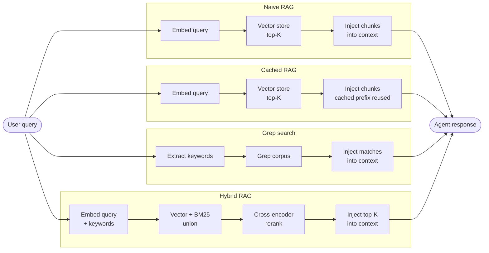

# support-agent-token-benchmark

**Status: v1 (Phase 3 ship, 2026-06-04).** Four retrieval architectures measured (Naive RAG, Cached RAG, Grep search, Hybrid RAG); cost numbers HIGH confidence; quality numbers LOW confidence pending v2 (see `ROADMAP.md` §"Quality re-measurement series"). Cached RAG was added in Phase 3 via Option Y (cost-only, no re-judge; quality inherited from Naive RAG by construction). Headline summary below; full report in `measurement/results/comparison.md`. Tags: `measurement-v1` (Phase 2 baseline), `cached-rag-v1` (Phase 3).

A measurement framework for comparing retrieval architectures used in LLM-based customer support agents, under realistic enterprise constraints. Built as the empirical foundation for a companion LinkedIn article on AI architecture trade-offs.

## What this project is

Four implementations of the same customer support task, measured head-to-head with the same task set, the same model, and the same cross-team modularity constraints:

- **Naive RAG.** Vector store + top-K retrieval + LLM agent with tool calls. The pattern most tutorials show and most v1 deployments ship.
- **Cached RAG.** Same as Naive RAG, with Anthropic's prompt caching enabled. The "have you tried the obvious optimization first" baseline.
- **Grep search.** A `grep`-style keyword search exposed as a single tool. The "traditional retrieval still works" alternative.
- **Hybrid RAG.** Vector + BM25 combined with reranking. The production-standard pattern mature teams converge on.

Two further architectures are scoped but deferred to v2:
- **Bounded tools** — one tool per policy class
- **Stuffed corpus** — full corpus in context, no retrieval

Three more are mentioned in the companion article but not measured: fine-tuned, deterministic routing with LLM at the edges, and no-LLM-at-all.

> _Companion article cross-reference:_ the LinkedIn article frames these architectures as a lettered taxonomy (A: Naive RAG, A+G: Cached RAG, B: Bounded tools, C: Grep search, D: Stuffed corpus, E: Hybrid RAG, F: Fine-tuned, H: Deterministic routing, I: No-LLM). The repo uses descriptive names directly; the letters appear only here for readers arriving from the article.

## Architecture comparison at a glance

The four measured architectures all start from the same user query and end at the same agent response. What changes is the retrieval path in the middle — and that path is where most of the token cost accumulates.



Same destination, four different paths. Token cost per task is dominated by what each lane injects into context — measured per-architecture in `measurement/results/comparison.md`.

## What this project is not

- Not a claim that one architecture is universally better. The point is to map the spectrum.
- Not a production-ready agent. Implementations are minimum viable — enough for honest token measurement, not enough for deployment.
- Not a benchmark suite. The task set is small (~17 tasks). Suggestive, not authoritative.

## The modularity constraint

All architectures must respect the same simulated department boundaries:

- The FAQ corpus is owned by **Support Content**. Any access goes through a tool exposed by them.
- The booking database is owned by **Booking Systems**. Same rule.
- The audit log is owned by **Compliance**. Same rule.
- AI Engineering owns the agent loop, system prompts, and tool orchestration only.

Every cross-team data flow must be an explicit tool call. No architecture is allowed to "win" by collapsing boundaries the org chart has set. This simulates the enterprise context the article is targeting — the context where the architecture decision is constrained by who owns what.

See `METHODOLOGY.md` §"Modularity constraint" for the full specification and `HANDOVER.md` for how each architecture implements the constraint.

## Why these architectures

The four measured architectures were chosen against an explicit framework: what is *popular*, what are the *misconceptions*, what is *industry standard*, and what are *our assumptions worth testing*. The full rationale is in `ARCHITECTURE_RATIONALE.md`. Brief summary:

- **Naive RAG** is the popular default and the source of most misconceptions about "RAG."
- **Cached RAG** is the obvious optimization production teams should try before any architectural change.
- **Grep search** tests the assumption that semantic retrieval is necessary for LLM agents.
- **Hybrid RAG** is the production-standard pattern; any alternative has to beat this, not the naive baseline.

Bounded tools and Stuffed corpus were considered and deferred. Cutting scope to ship the load-bearing comparison first is itself a deliberate decision; see `ROADMAP.md` for v2 scope.

## Quick start

```bash
# Install dependencies
pip install -r requirements.txt

# Set your API key
export ANTHROPIC_API_KEY=sk-ant-...

# Run the benchmark on the four v1 measured architectures
python -m measurement.runner --architectures naive_rag,cached_rag,grep_search,hybrid_rag --tasks measurement/tasks.jsonl --runs 3

# Score with the LLM-as-judge
python -m measurement.judge --runs-dir measurement/results/runs/<your-dated-dir>

# Do NOT run `python -m measurement.runner --report` — it overwrites the
# hand-authored comparison.md including the §10 adversarial-review narrative
# (issue #42, fix tracked as §11 template renderer).
```

Expected runtime: ~45 minutes for the full task set + judge across the four measured architectures (or ~30 minutes for the three uncached architectures only).

## Repository structure

```
.
├── README.md                          # You are here
├── ARCHITECTURE_RATIONALE.md          # Why these architectures, why not others
├── ROADMAP.md                         # v1 scope, v2 deferred items, future variants
├── HANDOVER.md                        # Cross-department artifact — how each architecture respects the modularity constraint
├── METHODOLOGY.md                     # How measurements are taken, including adversarial review discipline
├── BUILD_PLAN.md                      # Phased execution plan
├── corpus/
│   └── swiss_faq.md                   # FAQ corpus (sourced from LangGraph tutorial)
├── data/
│   └── travel.sqlite                  # Booking data (sourced from LangGraph tutorial)
├── architectures/
│   ├── naive_rag/                   # Vector store + top-K retrieval
│   ├── cached_rag/                  # Naive RAG + Anthropic prompt caching
│   ├── grep_search/                 # Keyword search as a tool
│   └── hybrid_rag/                  # Vector + BM25 + reranking
├── architectures_deferred/            # Placeholders for Bounded tools and Stuffed corpus (v2)
├── measurement/
│   ├── runner.py                      # Orchestrates measurement runs
│   ├── tokens.py                      # Token accounting
│   ├── tasks.jsonl                    # Benchmark task set
│   └── results/
│       ├── architecture_<id>.json     # Per-architecture raw measurements
│       └── comparison.md              # Generated comparison report
└── notebooks/
    └── analysis.ipynb                 # Visualization, distribution plots
```

## Headline results

v1, Phase 3 measurement (v1 sweep `5a1a6e8`, judge snapshot `1dda831`, Phase 3 Cached RAG sweep `f32ffe3`, task set `tasks-frozen-v1`):

| Architecture | Median input tokens / task | Mean input tokens / task | Success rate (median of 3) | CoV across runs | Mean cost / run (list price) |
|--------------|---------------------------:|-------------------------:|---------------------------:|----------------:|-----------------------------:|
| **Naive RAG**    | **12,354** | 13,064 | **7/17 (41%)** | 6.3% | $0.0548 |
| **Cached RAG**   | 12,503 | 13,863 | = Naive RAG ¹ | 7.6% | **$0.0432** (−21%) |
| Grep search  | 17,213 | 20,349 | 7/17 (41%) | 14.9% | $0.0779 |
| Hybrid RAG   | 13,312 | 16,291 | 6/17 (35%) | 11.7% | $0.0657 |

¹ Cached RAG quality = Naive RAG by construction (Option Y; prompt caching changes pricing, not the tokens the model sees). Re-judging deferred to v2.

**Cost story (HIGH confidence):** Among uncached architectures, Naive RAG is cheapest. Hybrid RAG +8% median / +25% mean. Grep search +39% median / +56% mean. Ordering is robust to filtering choice, robust to known Hybrid RAG retrieval bugs (which affect quality not cost), and within architectural explanation (vector_search k=4 < hybrid_search k=6 < grep_corpus variable lines).

**Caching effect (HIGH confidence — Phase 3):** Prompt caching on Naive RAG (system prompt + tool definitions cached, retrieved context not) drops per-run cost by 21% (from $0.0548 to $0.0432). The savings are 32% on the input side; output cost is unchanged and now dominates (38% of cached bill vs 28% of uncached). Caching shifts cost *shape*, not total magnitude — the pre-registered 50–80% input-cost-reduction hypothesis over-anchored on cache-read pricing without modeling the un-cached output share.

**Quality story (LOW confidence — preliminary):** All three architectures cluster in a 35–41% pass-rate band. During §10 adversarial review we identified a methodology defect (Finding C3: the LLM-as-judge prompt embeds the architecture name, producing asymmetric scoring strictness). The 6-point spread is *within* the unquantified label-leakage effect and should not be read as architecture-quality ranking. A v2 measurement cycle (blinded judge + Hybrid RAG bug fixes) is queued in `ROADMAP.md`.

Per-task-class breakdowns, full token decomposition, variance reporting, and the complete §10 confidence narrative are in `measurement/results/comparison.md`.

## Methodology summary

- **Agent model:** `claude-sonnet-4-6` (Sonnet 4.6 dateless ID; current mid-tier production default)
- **Judge model:** `claude-opus-4-7` (Opus 4.7 dateless ID; strongest current model, used for LLM-as-judge scoring)
- **Task set:** ~17 tasks across four classes, weighted to reflect realistic production traffic (mixed-heavy, see `measurement/tasks.md`)
- **Token counting:** Provider-reported `usage` from API response; decomposition via Anthropic's `client.beta.messages.count_tokens()` API (not `tiktoken`, which is OpenAI's)
- **Latency:** Single-request wall-clock time, no concurrency, no load testing
- **Success criteria:** Per-task rubric scored by LLM-as-judge, 10% human spot-check
- **Excluded from cost:** Vector store hosting, embedding API calls, developer time
- **Pre-publication adversarial review:** All findings undergo a documented review for tuning-effort asymmetry, task-set bias, and counterfactual reasoning before publication. See `METHODOLOGY.md` and the "Confidence and known biases" section in `comparison.md`.

Full details in `METHODOLOGY.md`.

## Related work

- LangGraph customer support tutorial — Naive RAG is closely modeled on this; corpus and database forked from here. The canonical tutorial path (`langchain-ai/langgraph` → `docs/docs/tutorials/customer-support/customer-support.ipynb`) was deprecated when the LangGraph docs were restructured; current docs index is at [docs.langchain.com/oss/python/langgraph](https://docs.langchain.com/oss/python/langgraph/overview). The original notebook is preserved in git history at that path. Corpus and database bytes are mirrored on this repo's [`data-mirror-v1` release](https://github.com/halolee/support-agent-token-benchmark/releases/tag/data-mirror-v1) — see issue [#19](https://github.com/halolee/support-agent-token-benchmark/issues/19).
- [Silicon Data, _Understanding LLM Cost Per Token_](https://www.silicondata.com/blog/llm-cost-per-token) — Token decomposition methodology.
- [SolDevelo, _A real-world test of RAG vs. Direct API calls_](https://soldevelo.com/blog/a-real-world-test-of-rag-vs-direct-api-calls/) — Independent measurement; relevant precedent.

## Author

Hao Li — building [OrbitBrain](https://orbitbrain.ai). Repo built as companion to a published analysis of LLM cost architecture; article link will appear in `HANDOVER.md` when ready.

## License

MIT. Forked corpus and database from LangGraph examples (per their license); see `corpus/` and `data/` for upstream attribution.
