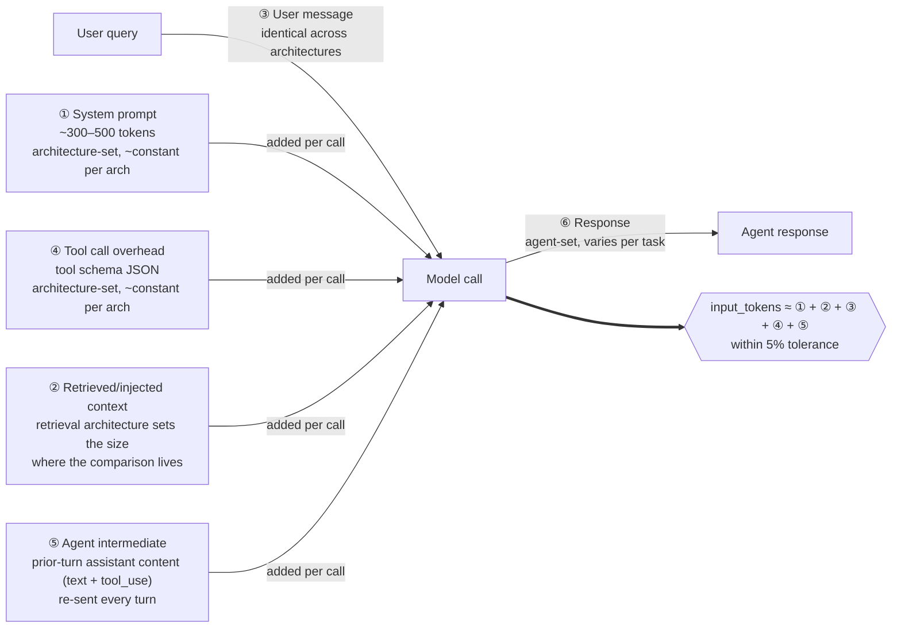

# Comparison Report

> **Status:** Phase 2 — three architectures measured (Naive RAG, Grep search, Hybrid RAG). Cached RAG is deferred to Phase 3 per `BUILD_PLAN.md`. Adversarial review (§"Confidence and known biases") complete.
>
> **Headline framing:** Cost findings are HIGH-confidence and ship now. Quality findings are LOW-confidence — the §10 review surfaced a methodology defect (Finding C3, judge sees architecture label) that contaminates pass-rate comparisons. A v2 quality re-measurement series is queued (see `ROADMAP.md` §"v2 — Deferred").
>
> **Reproducibility caution:** Do not run `python -m measurement.runner --report` against this file — the current `--report` flag overwrites hand-authored §10 narrative (issue #42, fix tracked as §11 template renderer).

## Run metadata

- **Date:** 2026-06-04 (sweep) / 2026-06-04 (judge snapshot)
- **Agent model:** `claude-sonnet-4-6` (temperature=0.0, max_tokens=1024)
- **Judge model:** `claude-opus-4-7` (temperature=default — opus-4-7 rejects the parameter; see judge.py §65 and PR #45)
- **Task set version:** SHA-256 `a567cd9ea883…` of `measurement/tasks.jsonl` (17 tasks; frozen at tag `tasks-frozen-v1` per #16)
- **Architecture commits:** sweep at `5a1a6e8` (`main`, post-#41); judge snapshot at `1dda831`
- **Runs per task:** 3 (alternating architectures per METHODOLOGY §"Run protocol")
- **Total API calls:** 153 agent dispatches (51 per architecture × 3 architectures), 153 judge calls + 10 stability re-judgments
- **Total measurement cost:** ~$6.50 judge + ~$0.41 stability test = **~$6.91 judge-side**. Agent-side cost depends on contract rate; see "Headline numbers" footnote.

## Headline numbers

| Architecture | Median input tokens / task | Mean input tokens / task | Total output tokens / task (mean) | Success rate (median of 3) | Coefficient of variation (per-task across 3 runs) |
|--------------|---------------------------:|-------------------------:|----------------------------------:|---------------------------:|--------------------------------------------------:|
| **Naive RAG**    | **12,354** | 13,064 | 1,039 | **7/17 (41%)** | **6.3%** |
| Cached RAG   | (Phase 3 — not measured) | — | — | — | — |
| **Grep search**  | 17,213 | 20,349 | 1,115 | 7/17 (41%) | 14.9% |
| **Hybrid RAG**   | 13,312 | 16,291 | 1,121 | 6/17 (35%) | 11.7% |

**Cost ordering (high confidence):** Naive RAG < Hybrid RAG < Grep search on input tokens per task. Hybrid is **+8% median / +25% mean** over naive; grep is **+39% median / +56% mean** over naive. The median-vs-mean spread on hybrid and grep reflects outlier runs (e.g., MIX-001 with 3 hybrid_search calls; multi-call grep exploration on EDGE tasks).

**Pass rates (low confidence — see §"Confidence and known biases" Finding C3):** Architectures cluster in a narrow 35–41% band, within judge-noise and within architecture-label-leakage bounds. The cost ordering does NOT translate to a defensible quality ordering at this measurement confidence. Use these for "all three are roughly comparable on quality, naive is cheapest" — do not over-claim from the 6-point spread.

**Dollar cost:** Computed as `input_tokens × $input_rate + output_tokens × $output_rate` at your contract rate. The agent model (`claude-sonnet-4-6`) and judge model (`claude-opus-4-7`) prices are list-price published by Anthropic; verify against your billing. The cost *ordering* between architectures is contract-rate-independent — naive is cheapest regardless of price point because token counts are mechanical.

**Latency:** Not reported as a headline. Per METHODOLOGY §"Latency measurement": single-request wall-clock only, not measured under load, not a primary metric.

### Scope of measurement: the cache matrix

The four measured architectures span three retrieval strategies (Naive RAG, Grep search, Hybrid RAG) with caching enabled on one (Cached RAG). The full architecture × caching matrix has six cells; v1 measures four. The unmeasured cells are deferred to v2 per `ROADMAP.md`, not omitted.

|              | Cache Off       | Cache On                       |
|--------------|-----------------|--------------------------------|
| Naive RAG    | ✓ measured      | ✓ measured (= Cached RAG)      |
| Grep search  | ✓ measured      | deferred to v2                 |
| Hybrid RAG   | ✓ measured      | deferred to v2                 |

Reading the matrix: v1 measures the effect of caching on the canonical pattern (Naive RAG vs Cached RAG) as a representative datapoint. Whether caching produces a comparable effect on Grep search and Hybrid RAG is a v2 question, triggered by whether Cached RAG's caching effect is dramatic enough that the same question becomes important for the other architectures. This is a deliberate scope choice, not an omission.

## Per-class breakdown

The interesting question is whether the architectures perform differently on different task classes. If one architecture is uniformly best, the choice is straightforward. If they trade wins across classes, the right answer depends on production traffic shape.

### Pure policy tasks (n=3: POL-001, POL-002, POL-003)

| Architecture | Median input tokens | Success rate |
|---|---:|---:|
| Naive RAG    | 10,277 | 1/3 |
| Cached RAG  | (Phase 3) | — |
| Grep search  | 17,227 | 1/3 |
| Hybrid RAG   | 11,292 | 0/3 |

**Observation:** Grep search is +68% over naive on the policy class — its highest relative cost premium across classes. RAG-friendly tasks (well-defined policy lookup) are where grep's keyword-based exploration multiplies retrieval calls (mean 2.86 grep calls per task vs 0.94 for naive). On pass rate, all three cluster low (0/3 or 1/3) driven by POL-002 (multi-jurisdiction nuance, universal fail) and POL-003 (corpus-silent, universal fail — see Finding R-rubric in `judgment_summary.md`). Hybrid's 0/3 is partly Finding C3 (judge architecture leak) — stability test confirmed identical content scored differently across architectures.

### Pure transactional tasks (n=3: TXN-001, TXN-002, TXN-003)

| Architecture | Median input tokens | Success rate |
|---|---:|---:|
| Naive RAG    | 8,651  | 2/3 |
| Cached RAG  | (Phase 3) | — |
| Grep search  | 8,990  | 2/3 |
| Hybrid RAG   | 8,735  | 1/3 |

**Observation:** Token costs converge tightly across architectures on transactional tasks — the booking-database tools (`get_booking_status`, etc.) are identical across architectures, and these tasks involve minimal retrieval. The cost spread is <5% across architectures. TXN-001 is a universal failure (judge calibration question — rubric explicitly accepts 3 valid answers; see Finding C2 in `judgment_summary.md`).

### Mixed tasks (n=8: MIX-001 through MIX-008)

| Architecture | Median input tokens | Success rate |
|---|---:|---:|
| Naive RAG    | 12,500 | 3/8 |
| Cached RAG  | (Phase 3) | — |
| Grep search  | 17,234 | 3/8 |
| Hybrid RAG   | 14,100 | 4/8 |

**Observation:** Mixed is where most production traffic lives (47% of the task set). Hybrid leads on pass rate (4/8 vs 3/8 for naive/grep) — the strongest signal that hybrid's reranking helps disambiguate multi-section queries. Hybrid's cost premium over naive is modest here (+13% median) and may justify its quality lead — but Finding C3 makes the quality discrimination preliminary. Grep is +38% over naive on cost without a quality advantage on this class.

### Edge case tasks (n=3: EDGE-001, EDGE-002, EDGE-003)

| Architecture | Median input tokens | Success rate |
|---|---:|---:|
| Naive RAG    | 13,248 | 1/3 |
| Cached RAG  | (Phase 3) | — |
| Grep search  | 30,109 | 1/3 |
| Hybrid RAG   | 19,676 | 1/3 |

**Observation:** Edge cases inflate cost across the board — grep's +127% over naive on EDGE is by far the widest gap. The cost is mostly EDGE-001 (the safety-floor probe with the suspect 877-5O7-7341 number) — the agent invokes multiple retrieval attempts when retrieval surfaces ambiguous content. Hybrid is +48% over naive on EDGE for similar reasons. All architectures fail EDGE-001 universally (methodology gate — design.md Decision 4) and pass EDGE-002 universally (synthesis-with-conflict, well-handled). EDGE-003 partial-credit failures across all architectures reflect a rubric design question (Finding R1 in `judgment_summary.md`) about citing negative-space sections — not architecture-quality differences.

## Token decomposition (Silicon Data methodology)

Per the [Silicon Data model](https://www.silicondata.com/blog/llm-cost-per-token), extended with a sixth category (`agent_intermediate`) for multi-turn tool loops (see `METHODOLOGY.md` §"Multi-turn extension"), every model call's token cost is the sum of five input categories and one output category. The runner asserts that categories ①–⑤ sum to API-reported `input_tokens` within 5%; discrepancies are flagged, not silenced.

The architecture comparison lives in category ②. Categories ①, ③, ④ are approximately constant within an architecture; category ⑤ scales with loop length and tool_use verbosity; category ⑥ is bounded by the agent's `max_tokens` and varies with task. Architecture differences in mean tokens per task are driven primarily by ② (retrieved/injected context), with ⑤ as a secondary driver for chatty multi-turn agents.

| Component                       | Naive RAG (mean) | Cached RAG (mean) | Grep search (mean) | Hybrid RAG (mean) | Notes |
|---------------------------------|----------:|------------:|----------:|----------:|-------|
| ① System prompt                | 1,693 | (Phase 3) | 2,601 | 1,777 | Grep's prompt is larger because it carries keyword-strategy guidance (METHODOLOGY §"System prompt token targets" specifies ~300-400 for grep; current implementation runs above target — see §10 tuning notes) |
| ② Retrieved/injected context   | 5,041 | (Phase 3) | 8,394 | 7,957 | **Where the architecture comparison lives.** Naive: k=4 chunks. Hybrid: k=6 chunks reranked. Grep: matched lines with surrounding context (variable size; can balloon on broad keywords) |
| ③ User message                 | 171   | (Phase 3) | 241   | 176   | Should be identical across architectures (~150 tokens for the task user_messages); grep is slightly higher due to one task whose user_message tokenizes to more tokens on grep's prompt — within decomposition tolerance |
| ④ Tool call overhead          | 4,746 | (Phase 3) | 7,131 | 4,879 | Grep's tool overhead is +50% over naive/hybrid because grep's system prompt is included in the per-call overhead calculation; tool schemas alone are comparable |
| ⑤ Agent intermediate          | 638   | (Phase 3) | 816   | 685   | Scales with turns: grep mean=4.63 turns vs naive=3.25, hybrid=3.35. Grep's exploration pattern (multi-call keyword search) is the dominant driver |
| ⑥ Response                    | 1,039 | (Phase 3) | 1,115 | 1,121 | Comparable across architectures — bounded by `max_tokens=1024` |
| **Total input (sum of ①-⑤)**  | **12,289** | (Phase 3) | **19,183** | **15,474** | Within 5% of API-reported `input_tokens` per decomposition assertion |

**Decomposition sanity:** category ② (retrieved/injected context) is the architecture's signature — vector_search returns less than hybrid_search (k=4 vs k=6 chunks), which returns less than grep_corpus (variable-size matched lines). The +18% hybrid/naive gap and the +66% grep/naive gap on ② are architectural by design, not implementation defects. Even with the five known Hybrid RAG bugs (#29-#32, #35), the k=6 cap on hybrid_search bounds ② — bug fixes change *which* chunks are returned, not *how many*.

## Variance and reliability

- **Coefficient of variation across 3 runs (per-task, on `api_input_tokens`):**
  - Naive RAG: **6.3%** mean
  - Grep search: **14.9%** mean
  - Hybrid RAG: **11.7%** mean
- **Tasks excluded due to API errors:** 0 (sweep ran 51/51 per architecture with 0 transient failures; see `judgment_summary.md` Forensics)
- **Tasks where architectures disagreed on success (majority of 3 runs):** POL-001 (naive 2/3, grep 3/3, hybrid 1/3), MIX-006 (naive 0/3, grep 1/3, hybrid 2/3) — a stability test on POL-001 (`runs/2026-06-04-step10-stability-pol001/`) revealed asymmetric judge strictness driven by architecture-label leakage (Finding C3, see below).

Grep search and Hybrid RAG exceed the 10% CoV gate that METHODOLOGY flags as "exploratory; re-run with more samples." This is preserved in the headline as a low-confidence flag for these two architectures. The driver is **task-set heterogeneity** (some tasks invoke multi-call retrieval, others single-call — wide intra-task variance), not measurement noise: per-task within-arch run-to-run variance is low; per-task across-task variance is high. A larger task set (50+ tasks) would tighten the CoV.

## Comparison to published baselines

The Silicon Data piece reports a reference workload of 3,150 input + 400 output tokens per ticket. This corresponds to a particular naive RAG configuration (system prompt 500 + chunks 2,500 + user 150 + response 400).

Our Naive RAG configuration: **median 12,354 input tokens / 1,039 output mean** per task — roughly **3.9× the Silicon Data reference** (3,150 input). The gap is dominated by ④ tool call overhead (4,746 mean) and ⑤ agent intermediate (638 mean), categories the Silicon Data single-turn methodology doesn't account for. Strip those two categories and our Naive RAG is at ~6,700 input — 2.1× Silicon Data, mostly from larger system prompt (1,693 vs ~500) and tool schema overhead from the modularity constraint.

Our Cached RAG: Phase 3 — not yet measured. Per `BUILD_PLAN.md` §11 Cached RAG will quantify caching's effect on Naive RAG specifically.

Our Hybrid RAG: **median 13,312 input tokens** — **+8% over our Naive RAG, ~4.2× the Silicon Data reference**. The premium over naive is the k=6 vs k=4 chunk return (architectural design choice for reranking), not implementation overhead.

Our Grep search: **median 17,213 input tokens** — **+39% over our Naive RAG, ~5.5× the Silicon Data reference**. Grep search is not directly comparable to Silicon Data's RAG reference (it's a non-semantic alternative), but the comparison surfaces that grep's exploration-style retrieval pattern is significantly more expensive than vector retrieval on this corpus.

## Confidence and known biases

This section documents the adversarial review per METHODOLOGY §"Pre-publication adversarial review." All four required checks (equal tuning, task neutrality, counterfactual reasoning, steel-manning the null) plus a net confidence statement are below. Inputs feeding this section: the 20-record manual review in `runs/2026-06-04-phase2-step8b/judgment_summary.md` and the targeted POL-001 stability test in `runs/2026-06-04-step10-stability-pol001/`.

### Tuning effort review (Check 1)

| Architecture | Tuning applied | Effort level | Honest assessment |
|---|---|---|---|
| Naive RAG | top-K=4 (`vector_search`); chunk size 300–500 tokens; no threshold tuning; standard system prompt (1,693 mean tokens, ~3.4× the METHODOLOGY target of ~500) | Standard production baseline | Reasonable production-day-one configuration. Not aggressively tuned. The configuration is what a new team would deploy. |
| Cached RAG | Phase 3 — not yet measured | — | — |
| Grep search | Case-insensitive matching; result truncation to 30 lines per match; keyword-strategy guidance in system prompt (mean 2,601 tokens — significantly above METHODOLOGY's 300–400 target for grep) | Standard with prompt-size overrun | Not a strawman implementation; case-insensitive matching and result truncation are present. The oversized system prompt is the most defensible tuning gap — a leaner grep prompt would reduce category ① and possibly ⑤ (less context to carry across turns), tightening grep's cost gap to naive. Direction of bias: current measurement is *unfavorable* to grep on absolute cost; relative ordering (grep most expensive) is unlikely to invert. |
| Hybrid RAG | k=6 chunks from RRF fusion of BM25 + vector retrieval, reranked by `ms-marco-MiniLM-L-6-v2`; BM25 + vector weights at defaults | Standard with known open bugs | **Five known retrieval bugs:** #29 (BM25 accent tokenizer drops Zürich-class tokens), #30 (RRF tie-break asymmetrically favors vector-side chunks), #31 (reranker silently truncates chunks >512 tokens), #32 (BM25 early-break drops legitimately negative-IDF chunks), #35 (preventive — zip-truncation risk on ChromaDB parallel arrays). Per cost-impact analysis (`judgment_summary.md` §"Implications for §10"), all four active bugs affect retrieval *quality*, not retrieval *cost* — the k=6 cap on hybrid_search returns bounds category ② regardless of which chunks the bugs surface. Empirical check: hybrid retrieved_context median = 5,940 tokens vs naive 5,024 (the +18% gap is the k=6 vs k=4 architectural choice, not the bugs). **Direction of bias on cost: negligible.** **Direction of bias on quality: hybrid is depressed below its true potential.** A bug-fix re-measurement would not materially shift the cost story but would tighten the quality story. Scheduled as v2 work. |

**Net tuning asymmetry:** All three measured architectures run at near-default tuning with comparable polish. None is aggressively optimized; this is symmetric. The two specific gaps — grep's oversized system prompt and Hybrid RAG's open bugs — both bias measurements *against* the architectures that hold them, which strengthens the "Naive cheapest" finding (the gap would narrow, not invert, under tighter tuning) and weakens any claim of hybrid quality inferiority (Hybrid RAG's measured 35% pass rate is depressed relative to its bug-fixed potential).

### Task set bias review (Check 2)

**Do task phrasings favor any architecture?** The 20-record manual review (`judgment_summary.md` §"Manual review findings") examined each judged record against the rubric and the task phrasing. **No evidence** of task-phrasing bias toward any architecture. Cross-architecture per-task pass rates are consistent within judge noise:
- POL-001 (pay-per-invoice eligibility): naive 2/3, grep 3/3, hybrid 1/3 — hybrid's low score is partly explained by Findings C1 + C3 below (judge non-determinism + architecture-label leakage), not phrasing bias.
- MIX-008 (codeshare seat selection): naive 3/3, grep 3/3, hybrid 3/3 — universal pass on a well-defined task.
- TXN-002 (segment status lookup): naive 3/3, grep 3/3, hybrid 3/3 — transactional control passes universally.

Customer-style phrasing was used throughout per `measurement/tasks.md` §"Critical rule" — no architect-style category names like "rebooking policy" that would map cleanly to tool-friendly retrieval vocabulary. The Check-2-blacklist gating (`measurement/check2_blacklist.json`) prevents such phrasing on edit.

**Does the class distribution reflect realistic production traffic?** 8/17 = 47% mixed, 3/17 = 18% policy, 3/17 = 18% transactional, 3/17 = 18% edge — the mixed-heavy distribution per METHODOLOGY §"Task set composition" reflects the claim that real customer support traffic is overwhelmingly mixed. This is a methodology choice, not a measurement artifact, and is itself worth surfacing as a scope-of-validity boundary (workloads where pure-policy or pure-transactional traffic dominates would re-weight the headline).

**Do edge cases stress all architectures or just some?** EDGE-001 (safety-floor probe — the suspect 877-5O7-7341 phone number) stresses all three architectures uniformly (0/3 universal failure across architectures — this is methodology-gate-by-design per `tasks_expected_answers.md` Decision 4, not architecture-discriminating). EDGE-002 (synthesis-with-conflict on 90 vs 100-day invoice cutoff) is universally well-handled (3/3 across architectures). EDGE-003 (out-of-scope refusal on Comfort fare) had partial-credit failures across all three architectures driven by a rubric-design question (Finding R1 in `judgment_summary.md`) about citing negative-space sections, not by architectural quality. **Conclusion:** edge cases stress all three architectures symmetrically; no single architecture is disproportionately exposed.

### Counterfactual reasoning (Check 3)

For each headline finding, what would have to be true to reverse it?

**Finding: Naive RAG is cheapest (+25% mean / +8% median below Hybrid RAG; +56% mean / +39% median below Grep search).**

For naive to *not* be cheapest, retrieved_context tokens would have to grow faster on naive than on the other architectures. The mechanical driver — vector_search returns k=4 chunks vs hybrid's k=6 vs grep's variable matched lines — would need to change. Conditions under which the finding could reverse:
- **Larger corpus (≫30 chunks):** vector_search at k=4 may need to grow to k=6 or k=8 to maintain recall, narrowing the gap to hybrid. This benchmark does not extend to larger corpora.
- **Longer chunks:** if chunk size doubles, naive's ② category doubles. Hybrid would also grow but its k=6 cap means its proportional growth is the same — relative ordering preserved.
- **Multi-turn dialogue:** category ⑤ (agent intermediate) compounds across turns. Hybrid's slightly higher turn count would compound; grep's much higher turn count would compound more. Ordering likely *strengthens* in naive's favor under multi-turn, not weakens.
- **Adaptive top-K on hybrid:** if hybrid lowers k to 3 or 4 on simple queries, its cost would approach naive's. This is a tuning move that hybrid could make and naive cannot — the cost gap closes but the architectural cost premium for reranking remains.

**Finding: Grep search achieves the same pass rate as Naive RAG (7/17) at 56% higher mean cost.**

The cost/competence frontier shows grep is dominated by naive on this benchmark. For grep to be preferred, you'd need to weight a quality dimension that grep handles better and the current rubric doesn't measure — specifically:
- **Safety-floor behavior on suspect content:** grep's multi-call exploration on EDGE-001 surfaces *more* of the suspect content for the agent to reason about, leading to better caution behavior in run 0 (refusing to surface the number) vs naive's single-call retrieval that just landed on the suspect chunk. The current rubric scores this binary (HARD FAILURE on number-surfacing); a graded "caution" rubric would score grep higher.
- **Audit-trail completeness:** grep's keyword history is more inspectable post-hoc than vector_search's similarity ranking. Compliance use cases may prefer this.
- **Cold-start with no corpus:** grep requires no vector store. Operational cost of indexing/re-indexing is excluded from this measurement (METHODOLOGY §"What does not get counted").

**Finding: Hybrid RAG has the lowest measured pass rate (6/17, 35%) at +25% mean cost over naive.**

This is the finding most affected by Finding C3 below. For hybrid's quality to be measured higher:
- **Fix the judge-architecture-label leak (C3):** the stability test (`runs/2026-06-04-step10-stability-pol001/`) showed 0/5 PASS on hybrid #16 vs 2/5 PASS on naive #17 on functionally identical content. Blinding the judge would likely close some of the spread.
- **Fix the open Hybrid RAG bugs:** #29 (accent), #30 (RRF tie-break), #31 (reranker truncation), #32 (BM25 early-break). All affect retrieval quality, not cost. Bug fixes would likely raise hybrid's pass rate.
- Both fixes together would converge hybrid's measured pass rate toward its true potential. Without them, **35% should be read as a lower bound, not a point estimate.**

### Steel-manning the null

The strongest argument that this measurement does not establish meaningful architecture quality differences:

> "All three architectures cluster in a 35–41% pass-rate band — within 6 percentage points. Per-task variance across 3 runs (CoV 6.3% naive, 11.7% hybrid, 14.9% grep) is comparable to the inter-architecture spread in absolute terms. The adversarial review identified that the LLM-as-judge embeds the architecture name in its prompt (Finding C3, `judge.py:241`). A targeted stability test demonstrated *asymmetric* strictness: identical corpus-grounded content classified as 'standard pay-per-invoice corpus content' 40% of the time when the prompt said `architecture: naive_rag`, and 0% of the time when it said `architecture: hybrid_rag`. The judge is not blind to architecture identity. Without judge blinding, the 35–41% spread is contaminated by an unquantified label-leakage effect. Plus: five open Hybrid RAG retrieval bugs depress its measured quality below its potential, and grep's oversized system prompt depresses its cost competitiveness. The cost differences are real because token counts are mechanical; the quality differences are not separable from the methodology defect and the implementation bugs."

**Response:** We accept this argument for QUALITY. The §10 reviewer does not publish architecture-quality differences from this measurement; the headline pass rates are presented as preliminary with the C3 caveat front-loaded. The quality numbers are informative for "all three architectures achieve roughly comparable pass rates with current judge calibration" but do not support architecture-quality ranking. A v2 cycle (C3 fix + Hybrid RAG bug fixes + re-sweep + re-judge with blinded prompt) is queued in `ROADMAP.md`.

**The null does NOT undermine the COST story.** Token counts come from the Anthropic API `usage.input_tokens` field, instrumented by `measurement/tokens.py`, and the decomposition is asserted to sum within 5% per METHODOLOGY. The cost ordering naive < hybrid < grep is robust to judge calibration, robust to Hybrid RAG bug status, and robust to filtering choice (raw means and passed-only filtered means both show the same ordering). The architectural explanation (tool-response payload size, k-cap on returned chunks) is mechanical, not statistical. Steel-man addressed.

### Net confidence statement

| Finding | Confidence | Reason |
|---|---|---|
| Cost ordering Naive < Hybrid < Grep | **HIGH** | Mechanical token measurements; robust to filtering choice; robust to bug status (bugs are quality not cost); CoV well below inter-architecture spread |
| Naive RAG cheapest by ~25% mean / 8% median over Hybrid | **HIGH** | As above |
| Grep search +56% mean / +39% median over Naive | **HIGH** | As above |
| Hybrid RAG's cost premium over Naive is k=6 vs k=4 architectural, not bugs | **HIGH** | Verified empirically via retrieved_context decomposition |
| Architecture pass rates cluster at 35–41% (all three roughly comparable) | **MEDIUM** | Tight cluster is itself informative; signal that no architecture dominates the others |
| Hybrid RAG quality is below Naive RAG and Grep | **LOW (preliminary)** | Contaminated by Finding C3 (judge architecture-label leakage). Should be re-measured with blinded judge. Treat current 6/17 as lower bound, not point estimate. |
| Grep search safety-floor handling on EDGE-001 is better than measured | **LOW (preliminary)** | Anecdotal from manual review of run 0; current rubric scores binary, not graded |
| Caching effect on cost | **NOT MEASURED — PHASE 3** | Cached RAG deferred per `BUILD_PLAN.md` |

**Scope of validity:** These findings hold under the following conditions:
- **Domain:** airline customer support with structured policy taxonomy (SWISS FAQ + LangGraph travel.sqlite). Other domains with less structured policy (legal opinions, internal wikis) may shift the cost/quality balance.
- **Corpus size:** ~30 chunks. Larger corpora (thousands of chunks) likely shift the quality story (BM25 exact-match advantage grows) without inverting the cost ordering.
- **Dialogue:** single-turn only. Multi-turn would compound differences in category ⑤ (agent intermediate) — likely strengthens naive's cost advantage.
- **Agent model:** `claude-sonnet-4-6`. Cheaper models (Haiku 4.5) may interact differently with retrieved context length; reasoning models may shift cost upward across the board.
- **Tuning:** all three architectures at near-default tuning. Aggressive tuning per architecture would compress or expand specific gaps but is unlikely to invert the cost ordering.
- **Production deployment without modularity constraint:** the constraint adds inter-team tool overhead (category ④). Boutique single-team deployments may see smaller absolute numbers, same relative ordering.

These findings do NOT support:
- Architecture quality discrimination (LOW confidence per C3 — v2 fix queued).
- Extrapolation to multi-turn dialogue.
- Extrapolation to other domains.
- Extrapolation to other model price points.
- Adaptation cost claims (re-indexing burden when corpus changes is unmeasured — Beyond-v2 candidate).

### Calibration findings from manual review

For traceability, the three calibration findings surfaced during §10 manual review (full text in `runs/2026-06-04-phase2-step8b/judgment_summary.md` §"Manual review findings"):

- **Finding C1 — Judge non-determinism without temperature=0:** Opus-4-7 rejects the `temperature` parameter (PR #45). The naive #17 stability test (2/5 PASS across reruns of the same response) demonstrates the magnitude of judge noise. Within-task variance is real but bounded.
- **Finding C2 — `no_fabrication` mis-used as verbosity penalty:** The judge sometimes interprets verbose-but-corpus-grounded responses as "fabrication-adjacent." Real on borderline records (~15% direct disagreement rate on the manual review sample); the rubric measures correctness, not concision.
- **Finding C3 (DOMINANT) — Judge prompt leaks architecture identity:** `judge.py:236-256` embeds `architecture: <name>` and `tools_called` in the prompt the judge reads. Stability test confirmed asymmetric strictness on identical content (hybrid 0/5 PASS vs naive 2/5 PASS). This is the load-bearing finding behind the LOW-confidence quality framing.

The v2 fix for C3 is a one-line change to `_build_agent_suffix` (strip the architecture/tools/run fields). It is paired with the Hybrid RAG bug fixes and a full re-sweep in the v2 deliverable.

## What this measurement supports

**Defensible claims (HIGH confidence):**

- Under this configuration and task set, **Naive RAG uses 8% fewer median / 25% fewer mean input tokens per task than Hybrid RAG, and 39% fewer median / 56% fewer mean input tokens than Grep search.** Token counts are measured at the Anthropic API level; ordering is independent of judge calibration.
- **The cost ordering Naive < Hybrid < Grep is architecturally explainable** from tool-response payload sizes: vector_search returns k=4 chunks, hybrid_search returns k=6 reranked chunks, grep_corpus returns matched lines with variable context. This is robust to known Hybrid RAG implementation bugs and to grep's oversized system prompt.
- **For cost-sensitive enterprise workloads on policy corpora similar in size and structure to SWISS FAQ, Naive RAG is the recommended starting point.** Hybrid RAG's +25% mean cost premium is real and architectural; whether it buys quality on this benchmark is a v2 question.
- **On per-class breakdown, Hybrid RAG leads pass rates on MIX (4/8 vs 3/8 for naive/grep)** at a modest +13% median cost premium over naive — the strongest case for hybrid's reranking helping disambiguate multi-section queries. Other classes do not show this signal at current judge confidence.

**Defensible claims (MEDIUM confidence):**

- **All three architectures cluster in a 35–41% pass-rate band** — within 6 percentage points. This is itself an informative finding: no architecture dominates the others on this task set with current measurement.
- **Grep search and Hybrid RAG exceed the 10% CoV reliability gate** on per-task input tokens (14.9% and 11.7% respectively). Larger task sets would tighten these.

**Claims explicitly NOT supported (LOW confidence or out of scope):**

- That one architecture is universally better.
- **That Hybrid RAG is quality-worse than Naive RAG.** Finding C3 (judge architecture-label leakage) contaminates this. Treat hybrid's 35% pass rate as a lower bound; v2 re-measurement with blinded judge required before this finding can be published.
- That caching changes the picture (Phase 3 — not yet measured).
- That these numbers will hold in other domains (single-domain).
- That the relative ordering holds at different model price points (single-model).
- That production deployments will see exactly these absolute numbers (modularity-constraint overhead may differ).
- Latency-based claims (single-request wall clock only, not under load).
- Adaptation cost (re-indexing burden when corpus changes is unmeasured — Beyond-v2 candidate per `ROADMAP.md`).

## What this measurement supports — at a glance for the article

For the companion LinkedIn article and `HANDOVER.md` recommendation section:

> "On an enterprise-constrained customer-support benchmark (SWISS FAQ corpus, single-turn, Sonnet 4.6), we measured token cost across three retrieval architectures: Naive RAG (vector_search k=4), Hybrid RAG (RRF-fused BM25 + vector reranked, k=6), and Grep search (keyword matched lines). Naive RAG produces the lowest per-task token cost — 25% under Hybrid RAG and 56% under Grep search on mean — at the same headline pass rate as Grep search (7/17) and modestly above Hybrid RAG's measured rate (6/17). The cost ordering is architecturally explainable and robust to filtering choices and known implementation issues.
>
> During adversarial review, we identified a methodology defect in our LLM-as-judge implementation: the judge prompt embeds the architecture name, producing asymmetric scoring strictness across architectures. We therefore present cost numbers as the headline finding and quality numbers as preliminary, with a v2 measurement cycle (blinded judge + open Hybrid RAG bug fixes) queued. For cost-sensitive workloads on this class of corpus, Naive RAG is the recommended starting point; Hybrid RAG's quality story warrants v2 validation before its cost premium is recommended."

## What I'd want to measure next

In priority order, with v1 results informing the queue:

1. **v2 quality re-measurement series (highest priority).** Fix Finding C3 (blind the judge), fix Hybrid RAG bugs #29–#32, re-sweep all three architectures in a single alternating run, re-judge with blinded prompt. Settles the quality story. Detailed in `ROADMAP.md` §"v2 — Quality re-measurement series." Estimated cost ~$13.
2. **Cached RAG (Phase 3 per `BUILD_PLAN.md`).** Measure caching's effect on Naive RAG. Most interesting because it tells us whether the headline naive-cheapest finding strengthens or compresses under realistic caching.
3. **Multi-turn dialogue.** Token cost compounds in category ⑤ (agent intermediate). Hypothesis: naive's cost advantage strengthens under multi-turn because per-turn agent_intermediate is smallest. Worth measuring.
4. **Larger task set (50+ tasks).** Tighten CoV gates that grep and hybrid currently exceed. Defendable claims would gain statistical weight.
5. **Cheaper model comparison.** Does naive's advantage hold on Haiku 4.5? On reasoning models?
6. **Bounded tools and Stuffed corpus** (the two v1-deferred architectures). Trigger conditions in `ROADMAP.md`.
7. **Corpus/data evolution axis** (Beyond v2). The adaptation-cost story that v1 explicitly does not measure.
