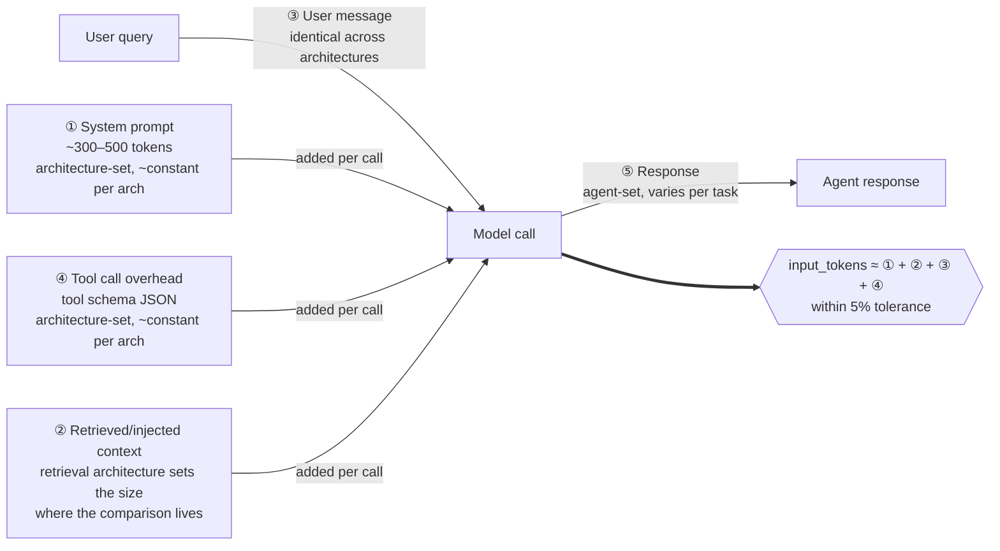

# Comparison Report

> **Status:** Template. Populated by `python measurement/runner.py --report` after benchmark runs complete.

## Run metadata

- **Date:** _TBD_
- **Agent model:** `claude-sonnet-4-6`
- **Judge model:** `claude-opus-4-7`
- **Task set version:** _TBD_ (hash of `tasks.jsonl`)
- **Architecture commits:** _TBD_ for each
- **Runs per task:** 3
- **Total API calls:** _TBD_
- **Total measurement cost:** $_TBD_

## Headline numbers

| Architecture | Mean total tokens / task | Mean cost / task | Cost / 10K tasks | Success rate | Mean latency |
|--------------|--------------------------|------------------|------------------|--------------|--------------|
| Naive RAG    | _TBD_                    | $_TBD_           | $_TBD_           | _TBD_%       | _TBD_s       |
| Cached RAG   | _TBD_                    | $_TBD_           | $_TBD_           | _TBD_%       | _TBD_s       |
| Grep search  | _TBD_                    | $_TBD_           | $_TBD_           | _TBD_%       | _TBD_s       |
| Hybrid RAG   | _TBD_                    | $_TBD_           | $_TBD_           | _TBD_%       | _TBD_s       |

### Scope of measurement: the cache matrix

The four measured architectures span three retrieval strategies (Naive RAG, Grep search, Hybrid RAG) with caching enabled on one (Cached RAG). The full architecture × caching matrix has six cells; v1 measures four. The unmeasured cells are deferred to v2 per `ROADMAP.md`, not omitted.

|              | Cache Off       | Cache On                       |
|--------------|-----------------|--------------------------------|
| Naive RAG    | ✓ measured      | ✓ measured (= Cached RAG)      |
| Grep search  | ✓ measured      | deferred to v2                 |
| Hybrid RAG   | ✓ measured      | deferred to v2                 |

Reading the matrix: v1 measures the effect of caching on the canonical pattern (Naive RAG vs Cached RAG) as a representative datapoint. Whether caching produces a comparable effect on Grep search and Hybrid RAG is a v2 question, triggered by whether Cached RAG's caching effect is dramatic enough that the same question becomes important for the other architectures. This is a deliberate scope choice, not an omission.

## Per-class breakdown

The interesting question is whether the architectures perform differently on different task classes. If one architecture is uniformly best, the choice is straightforward. If they trade wins across classes, the right answer depends on production traffic shape.

### Pure policy tasks

| Architecture       | Mean tokens | Mean cost | Success rate |
|--------------------|-------------|-----------|--------------|
| Naive RAG                  | _TBD_       | $_TBD_    | _TBD_%       |
| Cached RAG                | _TBD_       | $_TBD_    | _TBD_%       |
| Grep search                  | _TBD_       | $_TBD_    | _TBD_%       |
| Hybrid RAG                  | _TBD_       | $_TBD_    | _TBD_%       |

**Observation:** _TBD — does the contrarian Grep search architecture hold its own on the case where RAG is theoretically strongest?_

### Pure transactional tasks

| Architecture       | Mean tokens | Mean cost | Success rate |
|--------------------|-------------|-----------|--------------|
| Naive RAG                  | _TBD_       | $_TBD_    | _TBD_%       |
| Cached RAG                | _TBD_       | $_TBD_    | _TBD_%       |
| Grep search                  | _TBD_       | $_TBD_    | _TBD_%       |
| Hybrid RAG                  | _TBD_       | $_TBD_    | _TBD_%       |

**Observation:** _TBD — control class; all architectures should perform similarly. If they don't, why?_

### Mixed tasks

| Architecture       | Mean tokens | Mean cost | Success rate |
|--------------------|-------------|-----------|--------------|
| Naive RAG                  | _TBD_       | $_TBD_    | _TBD_%       |
| Cached RAG                | _TBD_       | $_TBD_    | _TBD_%       |
| Grep search                  | _TBD_       | $_TBD_    | _TBD_%       |
| Hybrid RAG                  | _TBD_       | $_TBD_    | _TBD_%       |

**Observation:** _TBD — this is where production traffic lives. Differences here matter most._

### Edge case tasks

| Architecture       | Mean tokens | Mean cost | Success rate |
|--------------------|-------------|-----------|--------------|
| Naive RAG                  | _TBD_       | $_TBD_    | _TBD_%       |
| Cached RAG                | _TBD_       | $_TBD_    | _TBD_%       |
| Grep search                  | _TBD_       | $_TBD_    | _TBD_%       |
| Hybrid RAG                  | _TBD_       | $_TBD_    | _TBD_%       |

**Observation:** _TBD — edge cases often expose failure modes that aggregate metrics hide._

## Token decomposition (Silicon Data methodology)

Per the [Silicon Data 5-category model](https://www.silicondata.com/blog/llm-cost-per-token), every model call's token cost is the sum of four input categories and one output category. The runner asserts that categories ①–④ sum to API-reported `input_tokens` within 5%; discrepancies are flagged, not silenced (see `METHODOLOGY.md` §"What gets counted").

The architecture comparison lives in category ②. Categories ①, ③, ④ are approximately constant within an architecture; category ⑤ is bounded by the agent's `max_tokens` and varies with task. Architecture differences in mean tokens per task are driven primarily by ② (retrieved/injected context).

| Component                       | Naive RAG (mean) | Cached RAG (mean) | Grep search (mean) | Hybrid RAG (mean) | Notes |
|---------------------------------|----------|------------|----------|----------|-------|
| System prompt                   | _TBD_    | _TBD_      | _TBD_    | _TBD_    | Should be comparable across architectures |
| Retrieved/injected context      | _TBD_    | _TBD_      | _TBD_    | _TBD_    | Naive RAG / Hybrid RAG: vector chunks. Grep search: grep matches |
| User message                    | _TBD_    | _TBD_      | _TBD_    | _TBD_    | Identical across architectures |
| Tool call overhead              | _TBD_    | _TBD_      | _TBD_    | _TBD_    | Tool schemas differ per architecture |
| Cache reads (Cached RAG only)          | n/a      | _TBD_      | n/a      | n/a      | Negative cost contribution |
| Response                        | _TBD_    | _TBD_      | _TBD_    | _TBD_    | Should be similar; if not, why? |

## Variance and reliability

- **Coefficient of variation across 3 runs:** _TBD_%
- **Tasks excluded due to API errors:** _TBD_
- **Tasks where architectures disagreed on success:** _TBD_

If CoV exceeds 10%, results are exploratory. Re-run with more samples.

## Comparison to published baselines

The Silicon Data piece reports a reference workload of 3,150 input + 400 output tokens per ticket. This corresponds to a particular naive RAG configuration (system prompt 500 + chunks 2,500 + user 150 + response 400).

Our Naive RAG configuration: _TBD — compare to Silicon Data reference_
Our Cached RAG: _TBD — measure of how much caching collapses Naive RAG_
Our Hybrid RAG: _TBD — production-grade RAG vs. naive_
Our Grep search: _TBD — non-semantic alternative_

## Confidence and known biases

This section documents the adversarial review (per METHODOLOGY) of the published findings. Mandatory before any number above is treated as a finding worth sharing.

### Tuning effort review

| Architecture | Tuning applied                                                | Effort level | Honest assessment |
|--------------|---------------------------------------------------------------|--------------|-------------------|
| Naive RAG            | _TBD: top-K choice, chunk strategy_                          | _TBD_        | _TBD_             |
| Cached RAG          | _TBD: caching configuration_                                 | _TBD_        | _TBD_             |
| Grep search            | _TBD: grep polish, keyword strategy in prompt_               | _TBD_        | _TBD_             |
| Hybrid RAG            | _TBD: BM25 weighting, reranker choice_                       | _TBD_        | _TBD_             |

If effort levels differ meaningfully, document the direction of the resulting bias: _TBD_

### Task set bias review

- **Do task phrasings favor any architecture?** _TBD: review each task for category-name leakage or grep-friendly vocabulary_
- **Does the class distribution reflect realistic production traffic?** _TBD: 8 of 17 tasks are mixed — is that realistic for your domain?_
- **Do edge cases stress all architectures or just some?** _TBD_

### Counterfactual reasoning

For each headline finding, articulate what would have to be true for it to reverse.

**If Cached RAG is cheapest:** Under what conditions would caching's advantage evaporate?
- Highly variable system prompts: _TBD_
- Cache eviction at scale: _TBD_
- Low repeat-prefix rate in production: _TBD_

**If Grep search is cheapest but loses on success rate:** Document the cost/competence frontier explicitly: _TBD_

**If Hybrid RAG wins overall:** Under what conditions would Naive RAG or Grep search be preferable?
- Smaller corpus: _TBD_
- Simpler queries: _TBD_
- Different cost sensitivities: _TBD_

**If success rates differ across architectures:** What failure modes drove the difference? Are they addressable in each architecture? _TBD_

### Steel-manning the null

The strongest argument that this measurement shows nothing meaningful:

> _TBD: write out the most compelling case that observed differences are artifacts of methodology choices, not genuine architectural properties. Then address it. If unaddressed, the finding is not ready._

### Net confidence statement

Based on the review above, confidence level of headline findings: _TBD: high / medium / low / preliminary_

Scope of validity: _TBD: the conditions under which the result holds_

## What this measurement supports

Defensible claims based on these numbers:

- Under the specified configuration and task set, Architecture _X_ uses _TBD_% fewer input tokens than Architecture _Y_ per task
- The cost difference per task is $_TBD_, or $_TBD_ at the scale of 10,000 tasks
- Architecture _Z_ achieves _TBD_% task success rate, while _W_ achieves _TBD_%
- Prompt caching (A vs Cached RAG) reduces per-task cost by _TBD_% on this workload

Claims this measurement does **not** support:

- That one architecture is universally better
- That these numbers will hold in other domains
- That production deployments will see exactly these results
- That the relative ranking holds at different model price points (single model measured)

## What I'd want to measure next

> _Populated after v1 results are in. Candidates listed in ROADMAP.md._

1. Bounded tools (bounded structured tools) — if reviewers argueBounded tools and Hybrid RAGdiffer meaningfully
2. Stuffed corpus (full corpus stuffed) — if Naive RAG and Hybrid RAG pay heavily for retrieval that corpus size doesn't justify
3. Caching variants for Hybrid RAG and Grep search — to isolate whether caching's advantage is Naive-RAG-specific
4. Cheaper model comparison — does the architectural advantage hold at lower price points?
5. Multi-turn dialogue — caching effects and architectural differences likely compound
6. Larger task set (50-100 tasks) — tighten statistical confidence
